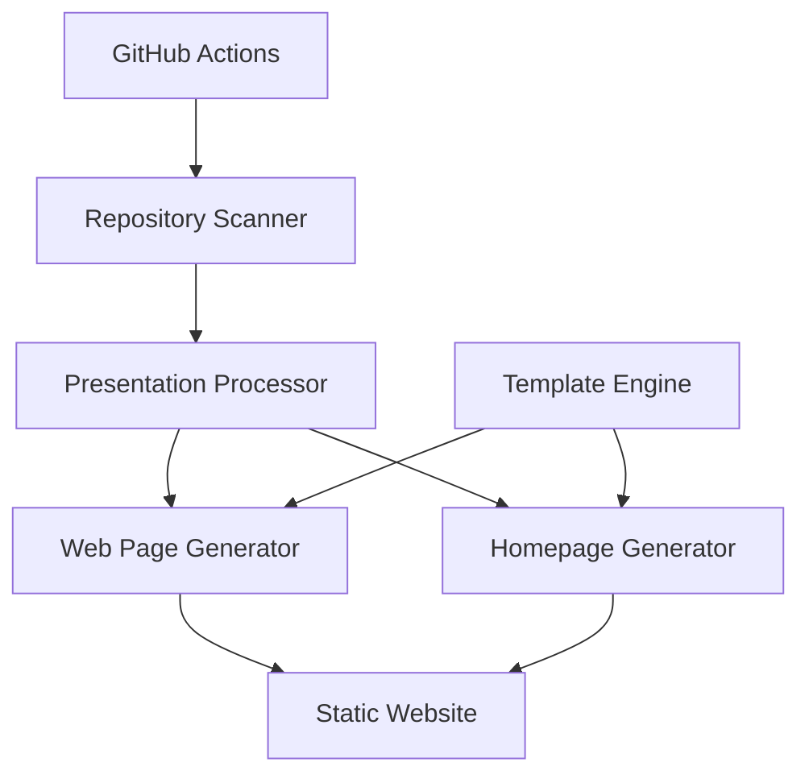

# Design Document

## Overview

The Deckset Website Generator will transform the existing single-presentation converter into a comprehensive multi-presentation website generator. The system will scan the repository for presentation folders, convert each Deckset markdown file to a web page, and create a unified homepage for navigation. The architecture will be modular, extensible, and automated through GitHub Actions.

## Architecture

### High-Level Architecture



### Core Components

1. **Repository Scanner**: Discovers presentation folders and markdown files
2. **Presentation Processor**: Parses markdown content and extracts slides/notes
3. **Web Page Generator**: Creates individual presentation HTML pages
4. **Homepage Generator**: Creates the main index page with presentation listings
5. **Template Engine**: Manages HTML templates for consistent styling
6. **GitHub Actions Workflow**: Automates the entire generation and deployment process

## Components and Interfaces

### 1. Repository Scanner (`scanner.py`)

**Purpose**: Discover and catalog all presentation folders in the repository

**Interface**:
```python
class PresentationScanner:
    def scan_presentations(self, root_path: str) -> List[PresentationInfo]
    def find_markdown_file(self, folder_path: str) -> Optional[str]
    def extract_presentation_title(self, markdown_path: str) -> str
    def is_presentation_folder(self, folder_path: str) -> bool
```

**Key Methods**:
- `scan_presentations()`: Scans all folders in repository root directory, excluding system folders
- `find_markdown_file()`: Implements priority logic - prefers file matching folder name, then first alphabetically
- `extract_presentation_title()`: Extracts title from markdown frontmatter or uses folder name as fallback
- `is_presentation_folder()`: Identifies folders containing markdown files as presentation folders

**Design Rationale**: The scanner implements specific file selection logic from Requirement 1.3-1.4, ensuring consistent behavior when multiple markdown files exist in a folder. This prevents ambiguity and provides predictable results for presentation authors.

### 2. Presentation Processor (`processor.py`)

**Purpose**: Parse markdown content and extract structured slide data

**Interface**:
```python
class PresentationProcessor:
    def process_presentation(self, markdown_path: str) -> ProcessedPresentation
    def extract_slides(self, content: str) -> List[Slide]
    def extract_notes(self, slide_content: str) -> str
    def extract_metadata(self, content: str) -> Dict[str, Any]
    def extract_slide_images(self, slide_content: str) -> List[str]
```

**Key Methods**:
- `process_presentation()`: Main processing pipeline for a single presentation
- `extract_slides()`: Splits content by slide separators and processes each slide
- `extract_notes()`: Extracts speaker notes marked with "^" prefix
- `extract_metadata()`: Parses frontmatter for presentation configuration
- `extract_slide_images()`: Parses markdown image syntax to discover referenced images

**Image Discovery Logic**: The processor parses each slide's markdown content using regex patterns to find image references in the format ``. It extracts the filename and resolves the path relative to the presentation folder. When multiple images exist in a slide, the first image found is used as the primary slide image for web display.

### 3. Web Page Generator (`generator.py`)

**Purpose**: Generate HTML pages for individual presentations

**Interface**:
```python
class WebPageGenerator:
    def __init__(self, template_path: str)
    def generate_presentation_page(self, presentation: ProcessedPresentation, output_path: str)
    def generate_homepage(self, presentations: List[PresentationInfo], output_path: str)
```

**Key Methods**:
- `generate_presentation_page()`: Creates HTML page for a single presentation
- `generate_homepage()`: Creates the main index page with presentation listings

### 4. Template Manager (`templates.py`)

**Purpose**: Manage HTML templates and provide rendering utilities

**Interface**:
```python
class TemplateManager:
    def load_template(self, template_name: str) -> Template
    def render_presentation(self, template: Template, data: Dict) -> str
    def render_homepage(self, template: Template, data: Dict) -> str
```

### 5. Main Generator (`main.py`)

**Purpose**: Orchestrate the entire generation process

**Enhanced Interface**:
```python
class DecksetWebsiteGenerator:
    def __init__(self, config: GeneratorConfig)
    def generate_website(self, output_dir: str = "docs")
    def generate_single_presentation(self, folder_path: str, output_dir: str)
```

## Data Models

### PresentationInfo
```python
@dataclass
class PresentationInfo:
    folder_name: str
    folder_path: str
    markdown_path: str
    title: str
    preview_image: Optional[str]
    slide_count: int
    last_modified: datetime
```

### Slide
```python
@dataclass
class Slide:
    index: int
    content: str
    notes: str
    image_path: Optional[str]
```

### ProcessedPresentation
```python
@dataclass
class ProcessedPresentation:
    info: PresentationInfo
    slides: List[Slide]
    metadata: Dict[str, Any]
```

### GeneratorConfig
```python
@dataclass
class GeneratorConfig:
    output_dir: str = "docs"
    template_dir: str = "templates"
    slides_dir: str = "slides"
    fallback_image: str = "slides/redacted.png"
    exclude_folders: List[str] = field(default_factory=lambda: ['.git', '.kiro', 'node_modules'])
```

## Error Handling

### Error Categories

1. **File System Errors**: Missing files, permission issues, disk space
2. **Parsing Errors**: Malformed markdown, invalid frontmatter
3. **Template Errors**: Missing templates, rendering failures
4. **Image Errors**: Missing slide images, invalid image formats

### Error Handling Strategy

```python
class GeneratorError(Exception):
    """Base exception for generator errors"""
    pass

class PresentationProcessingError(GeneratorError):
    """Errors during presentation processing"""
    pass

class TemplateRenderingError(GeneratorError):
    """Errors during template rendering"""
    pass
```

### Error Handling Strategy

**Design Decision**: Implement graceful degradation to ensure partial failures don't prevent website generation (Requirement 5.1-5.5). The system prioritizes continuity over perfection.

**Error Recovery Mechanisms**:
- Continue processing other presentations when one fails (Requirement 5.1)
- Use fallback "redacted.png" images for missing slide images (Requirement 5.2)
- Display raw content or skip problematic slides when markdown parsing fails (Requirement 5.3)
- Generate basic homepage with available presentations even if some fail (Requirement 5.4)
- Provide clear error messages with context for debugging (Requirement 5.5)
- Log all errors with sufficient detail for troubleshooting

**Design Rationale**: This approach ensures that the website remains functional even when individual presentations have issues, providing a better user experience and reducing maintenance overhead.

## Testing Strategy

**Note**: All tests are organized under the `tests/` directory following Python best practices, with test files named `test_*.py` for automatic discovery by pytest.

### Unit Tests

1. **Scanner Tests**:
   - Test folder discovery with various directory structures
   - Test markdown file selection logic
   - Test title extraction from different markdown formats

2. **Processor Tests**:
   - Test slide splitting with various separator formats
   - Test note extraction with different note formats
   - Test metadata parsing with various frontmatter formats

3. **Generator Tests**:
   - Test HTML generation with mock data
   - Test template rendering with various data structures
   - Test error handling scenarios

### Integration Tests

1. **End-to-End Tests**:
   - Test complete website generation with sample presentations
   - Test GitHub Actions workflow with test repository
   - Test generated website functionality in browser

2. **File System Tests**:
   - Test with various folder structures
   - Test with missing files and permissions
   - Test output directory creation and cleanup

### Test Data Structure

```
tests/
├── fixtures/
│   ├── sample_presentations/
│   │   ├── presentation1/
│   │   │   ├── presentation1.md
│   │   │   └── slides/
│   │   └── presentation2/
│   └── expected_outputs/
├── test_scanner.py
├── test_processor.py
├── test_generator.py
├── test_templates.py
└── test_integration.py
```

## File Structure

### Generated Website Structure

```
docs/                           # GitHub Pages output directory
├── index.html                  # Homepage with presentation listings
├── presentations/              # Individual presentation pages
│   ├── docker-kubernetes-101.html
│   ├── code-to-cloud-native.html
│   └── ...
├── slides/                     # Slide images (copied from source folders)
│   ├── docker-kubernetes-101/
│   │   ├── 1.png
│   │   ├── 2.png
│   │   └── ...
│   └── redacted.png           # Fallback image
├── assets/                     # Static assets
│   ├── css/
│   │   └── styles.css
│   └── js/
│       └── main.js
└── images/                     # Preview images for homepage
    ├── docker-kubernetes-101-preview.png
    └── ...
```

### Source Code Structure

```
├── scanner.py                  # Repository scanning logic
├── processor.py                # Markdown processing logic
├── generator.py                # HTML generation logic
├── templates.py                # Template management
├── models.py                   # Data models
├── main.py                     # Enhanced main script
├── requirements.txt            # Python dependencies
├── templates/
│   ├── presentation.html       # Individual presentation template
│   ├── homepage.html          # Homepage template
│   └── base.html              # Base template with common elements
└── .github/
    └── workflows/
        └── generate-website.yml # GitHub Actions workflow
```

## Template Design

### Styling Framework

**Design Decision**: Use Tailwind CSS for consistent styling across all generated pages (Requirement 3.1). This provides:
- Utility-first CSS approach for rapid development
- Built-in responsive design capabilities
- Consistent design system across all components
- Easy customization and maintenance

### Homepage Template Features

- Grid layout of presentation cards with responsive breakpoints
- Preview images from first slide with fallback placeholder handling (Requirement 4.2-4.3)
- Presentation metadata display (title, slide count, last modified) (Requirement 4.5)
- Mobile-responsive design that adapts to different screen sizes (Requirement 3.2)
- Clickable presentation cards for navigation (Requirement 4.4)
- Search/filter functionality (future enhancement)

**Design Rationale**: The homepage serves as the primary entry point and must provide clear visual hierarchy and easy navigation. Preview images help users quickly identify presentations, while metadata provides context for selection.

### Presentation Template Enhancements

- Responsive layout for slide images with proper sizing and borders (Requirement 3.3)
- Speaker notes display with markdown-to-HTML conversion (Requirement 2.5)
- Navigation between presentations with consistent styling (Requirement 3.5)
- Slide counter and progress indicator
- Fallback image handling for missing slides (Requirement 2.4)
- Readable typography and spacing for text content (Requirement 3.4)
- Print-friendly styles

**Design Rationale**: Individual presentation pages must balance visual slide content with textual notes, ensuring both are accessible and well-formatted across devices.

## GitHub Actions Integration

### Workflow Triggers

- Push to main branch
- Manual workflow dispatch
- Scheduled runs (optional)

### Workflow Steps

1. **Setup Environment**: Install Python and dependencies
2. **Generate Website**: Run the website generator
3. **Deploy to GitHub Pages**: Publish generated content
4. **Notify on Failure**: Send notifications for failed builds

### Deployment Strategy

- Use GitHub Pages for hosting
- Deploy to `docs/` directory or `gh-pages` branch
- Support custom domain configuration
- Enable HTTPS by default