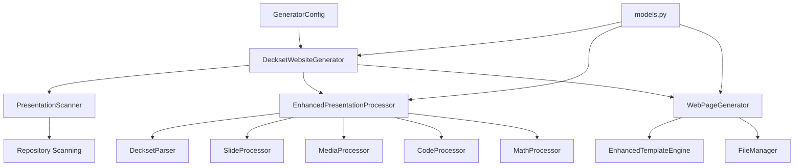
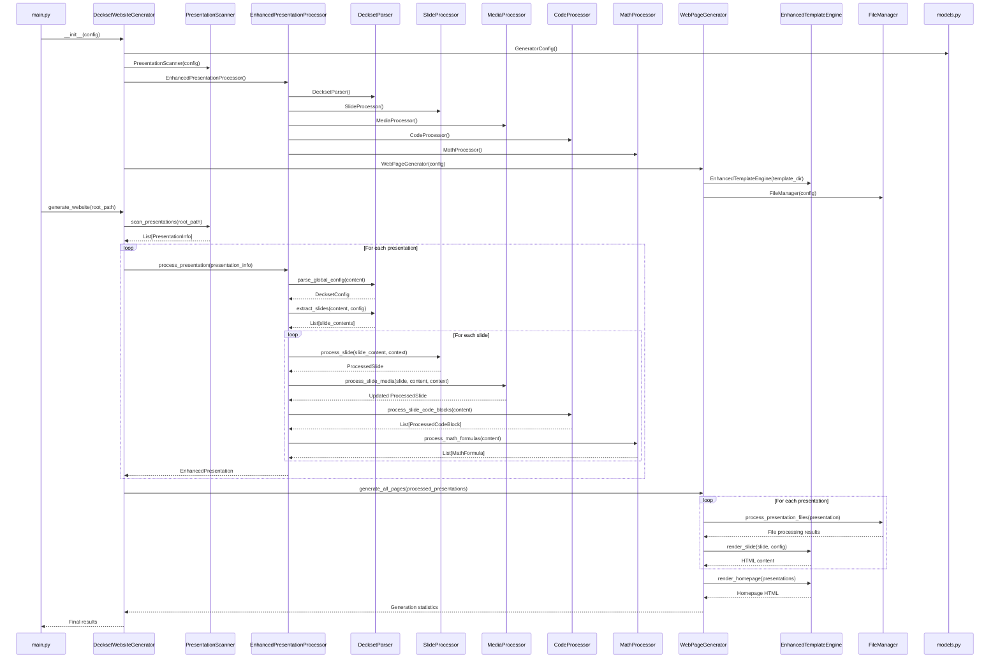

# Enhanced Design Document

## Overview

This enhanced design implements a comprehensive Deckset-compatible markdown processor with all enhanced features enabled by default. The system parses and renders all Deckset markdown features while maintaining the existing multi-presentation website structure. The architecture emphasizes modularity, extensibility, and faithful reproduction of Deckset's markdown semantics in a responsive web environment.

## Architecture

### High-Level Architecture



### Component Interaction Diagram

The following diagram shows the detailed interaction between all components starting from `DecksetWebsiteGenerator` in `main.py`:



## Core Components

### 1. Main Orchestrator (`main.py`)

**DecksetWebsiteGenerator Class**: The main orchestrator that coordinates the entire website generation process.

**Key Methods**:
- `__init__(config)`: Initializes all components (Scanner, EnhancedProcessor, WebPageGenerator)
- `generate_website(root_path, output_dir)`: Main entry point orchestrating the full pipeline
- `generate_single_presentation(folder_path, output_dir)`: Generates a single presentation
- `_scan_presentations()`: Discovers presentations using the scanner
- `_process_presentations()`: Processes each presentation with error handling
- `_generate_website_pages()`: Generates HTML pages and handles file operations

### 2. Repository Scanner (`scanner.py`)

**PresentationScanner Class**: Discovers presentation folders and identifies markdown files.

**Key Methods**:
- `scan_presentations(root_path)`: Scans for presentation folders
- `is_presentation_folder(folder_path)`: Validates if a folder contains presentations
- `_create_presentation_info(folder)`: Creates PresentationInfo objects
- `_has_multiple_independent_presentations()`: Detects multi-presentation folders

### 3. Enhanced Presentation Processor (`enhanced_processor.py`)

**EnhancedPresentationProcessor Class**: Orchestrates comprehensive Deckset markdown processing.

**Component Integration**:
- **DecksetParser**: Parses Deckset-specific syntax and global commands
- **SlideProcessor**: Handles slide content and layout processing
- **MediaProcessor**: Processes images, videos, and audio with modifiers
- **CodeProcessor**: Handles syntax highlighting and line emphasis
- **MathProcessor**: Processes LaTeX math expressions

**Key Methods**:
- `process_presentation(presentation_info)`: Main processing pipeline
- `_parse_global_config(content)`: Extracts global Deckset configuration
- `_extract_slides(content, config)`: Splits content into individual slides
- `_process_slides(slide_contents, config, presentation_info)`: Processes each slide with all features

### 4. Specialized Processors

#### Deckset Parser (`deckset_parser.py`)
- Parses global commands like `slidenumbers: true`, `footer: text`
- Handles slide-specific commands like `[.background-image: file.jpg]`
- Processes `[fit]` headers for auto-scaling
- Extracts speaker notes and footnotes
- Implements emoji shortcode processing

#### Slide Processor (`slide_processor.py`)
- Processes individual slide content and layout
- Handles multi-column layouts with `[.column]` syntax
- Applies autoscaling and layout transformations
- Manages slide-specific configurations

#### Media Processor (`media_processor.py`)
- Processes images with placement modifiers (`![left]`, `![fit]`, `![background]`)
- Handles video processing with autoplay, loop, and mute options
- Manages audio files with playback controls
- Creates image grids for multiple consecutive images

#### Code Processor (`code_processor.py`)
- Provides syntax highlighting for code blocks
- Handles line emphasis and highlighting directives
- Supports multiple programming languages
- Integrates with Prism.js for web rendering

#### Math Processor (`math_processor.py`)
- Processes LaTeX math expressions (both inline and display)
- Validates LaTeX syntax
- Integrates with MathJax for web rendering
- Handles both `$...$` and `$$...$$` syntax

### 5. Web Page Generator (`generator.py`)

**WebPageGenerator Class**: Creates HTML pages and manages output generation.

**Key Methods**:
- `generate_all_pages(processed_presentations)`: Generates all presentation pages and homepage
- `generate_presentation_page(presentation, output_path)`: Creates individual presentation HTML
- `generate_homepage(presentations, output_path)`: Creates the main index page
- `_render_enhanced_presentation(presentation)`: Renders presentations with full Deckset features

### 6. Enhanced Template Engine (`enhanced_templates.py`)

**EnhancedTemplateEngine Class**: Advanced HTML template rendering with full Deckset feature support.

**Template Files**:
- `templates/slide.html`: Main slide template with all Deckset features
- `templates/homepage.html`: Homepage template for presentation listings
- `templates/slide_styles.css`: Deckset-compatible styling
- `templates/assets/js/slide-viewer.js`: Interactive slide navigation

**Key Rendering Methods**:
- `render_slide(slide, config)`: Renders individual slides with all features
- `render_homepage(presentations)`: Renders the main homepage
- `render_columns(columns)`: Handles multi-column layouts
- `render_background_image(image)`: Processes background images
- `render_video_player(video)`: Creates video players with controls
- `render_code_block(code_block)`: Renders syntax-highlighted code
- `render_math_formula(formula)`: Renders mathematical expressions

### 7. File Manager (`file_manager.py`)

**FileManager Class**: Handles file operations and asset management.

**Key Methods**:
- `process_presentation_files(presentation)`: Copies and optimizes presentation assets
- `copy_media_files(src_dir, dest_dir)`: Handles media file copying
- `optimize_images()`: Optimizes images for web delivery
- `ensure_output_directory(path)`: Creates necessary output directories

## Data Models

All data models are defined in `models.py` with comprehensive type definitions:

### Core Models
- **PresentationInfo**: Metadata about discovered presentations
- **ProcessedPresentation**: Fully processed presentation with slides
- **Slide**: Individual slide with content and metadata
- **GeneratorConfig**: Global generator configuration

### Enhanced Models  
- **EnhancedPresentation**: Comprehensive presentation with Deckset features
- **ProcessedSlide**: Enhanced slide with media, code, math, and layout features
- **DecksetConfig**: Global Deckset configuration settings
- **SlideConfig**: Slide-specific configuration overrides

### Media Models
- **ProcessedImage**: Images with placement and scaling modifiers
- **ProcessedVideo**: Videos with autoplay and control options
- **ProcessedAudio**: Audio files with playback controls
- **MediaModifiers**: Placement and playback configuration

### Content Models
- **ColumnContent**: Multi-column layout content
- **ProcessedCodeBlock**: Syntax-highlighted code with line emphasis
- **MathFormula**: LaTeX mathematical expressions
- **ImageGrid**: Grid layouts for multiple images

## Error Handling

The system implements comprehensive error handling with custom exception classes:

- **GeneratorError**: Base exception for all generator errors
- **ScanningError**: Repository scanning failures
- **PresentationProcessingError**: Presentation processing failures
- **TemplateRenderingError**: Template rendering failures
- **DecksetParsingError**: Deckset syntax parsing errors
- **MediaProcessingError**: Media file processing errors
- **SlideProcessingError**: Slide processing failures
- **FileOperationError**: File system operation errors

## Configuration and Extensibility

### Generator Configuration
```python
@dataclass
class GeneratorConfig:
    output_dir: str = "docs"
    template_dir: str = "templates"
    slides_dir: str = "slides"
    exclude_folders: List[str] = field(default_factory=lambda: [
        '.git', '.kiro', 'node_modules', '__pycache__', '.pytest_cache'
    ])
```

### Deckset Configuration
```python
@dataclass
class DecksetConfig:
    theme: Optional[str] = None
    autoscale: bool = False
    slide_numbers: bool = False
    footer: Optional[str] = None
    background_image: Optional[str] = None
    fit_headers: List[str] = field(default_factory=list)
    # ... additional Deckset settings
```

## Features Implementation Status

**All Deckset Features Working Correctly:**
- ✅ **Speaker Notes**: `^ This is a speaker note` syntax properly extracted and hidden
- ✅ **Image Processing**: 
  - Background images: `` → background with cover scaling
  - Positioned images: `` → inline image with right placement
  - Fit images: `` → background with fit scaling
- ✅ **Code Blocks**: Syntax highlighting with proper `<pre><code>` structure
- ✅ **Footer and Slide Numbers**: Global config `footer: © Text` and `slidenumbers: true` working
- ✅ **Video Processing**: `` properly detected and processed
- ✅ **Mathematical Formulas**: MathJax integration for `$$...$$` syntax
- ✅ **Multi-column Layouts**: `[.column]` syntax for side-by-side content
- ✅ **Fit Headers**: `[fit]` modifier for auto-scaling headers
- ✅ **Emoji Shortcodes**: `:emoji:` syntax support
- ✅ **Footnotes**: Footnote references and definitions
- ✅ **Responsive Design**: All features work on mobile and desktop

**Test Coverage:**
- All 279 tests passing
- Comprehensive coverage of all processors and templates
- End-to-end testing with real Deckset presentations
- Integration testing between all components

**Generated Output Quality:**
- Clean, semantic HTML structure
- Proper CSS classes for styling
- Accessible markup with ARIA labels
- Responsive design across devices
- Performance optimized with lazy loading for images