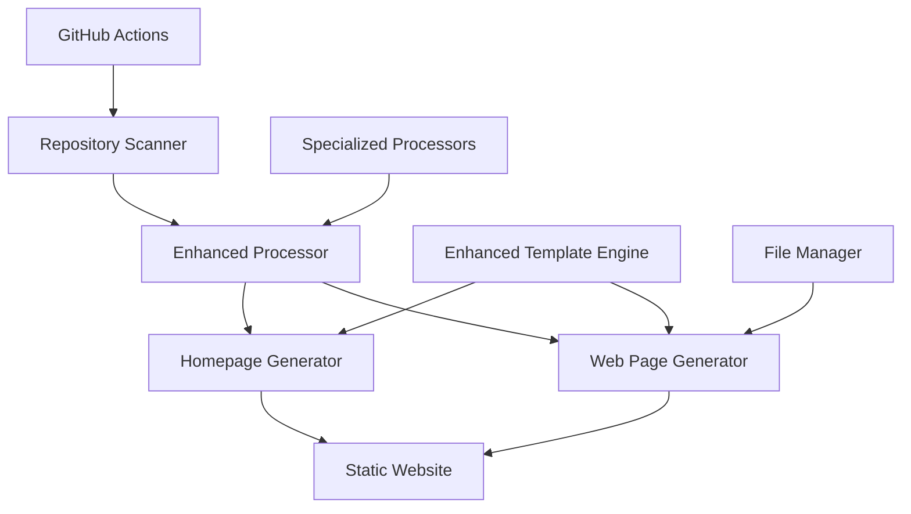

# Design Document

## Overview

The Deckset Website Generator is a comprehensive multi-presentation website generator that transforms Deckset markdown presentations into a unified website. The system scans the repository for presentation folders, processes each Deckset markdown file with full compatibility support, and generates a complete website with individual presentation pages and a homepage for navigation. The architecture is modular, extensible, and automated through GitHub Actions.

## Architecture

### High-Level Architecture



### Core Components

1. **Repository Scanner** (`scanner.py`): Discovers presentation folders and markdown files
2. **Enhanced Presentation Processor** (`enhanced_processor.py`): Orchestrates comprehensive Deckset markdown processing
3. **Specialized Processors**: Handle specific Deckset features (media, code, math, slides)
4. **Web Page Generator** (`generator.py`): Creates individual presentation HTML pages and homepage
5. **Enhanced Template Engine** (`enhanced_templates.py`): Advanced HTML template rendering with Deckset feature support
6. **File Manager** (`file_manager.py`): Handles file operations and asset management
7. **GitHub Actions Workflow**: Automates the entire generation and deployment process

### Python Class Interaction Diagram

The following diagram shows the interaction between all Python classes starting from `main.py`:

## Data Models

All data models are defined in `models.py` and include both basic models for backward compatibility and enhanced models for comprehensive Deckset feature support.

### Core Models

#### PresentationInfo
```python
@dataclass
class PresentationInfo:
    folder_name: str
    folder_path: str
    markdown_path: str
    title: str
    preview_image: Optional[str] = None
    slide_count: int = 0
    last_modified: Optional[datetime] = None
```

#### ProcessedPresentation (Basic)
```python
@dataclass
class ProcessedPresentation:
    info: PresentationInfo
    slides: List[Slide]
    metadata: Dict[str, Any] = field(default_factory=dict)
```

#### EnhancedPresentation
```python
@dataclass
class EnhancedPresentation:
    info: PresentationInfo
    slides: List[ProcessedSlide]
    global_config: DecksetConfig
    metadata: Dict[str, Any] = field(default_factory=dict)
```

### Configuration Models

#### GeneratorConfig
```python
@dataclass
class GeneratorConfig:
    output_dir: str = "site"
    template_dir: str = "templates"
    slides_dir: str = "slides"
    exclude_folders: List[str] = field(default_factory=lambda: [
        '.git', '.kiro', 'node_modules', '__pycache__', '.pytest_cache'
    ])
```

#### DecksetConfig
```python
@dataclass
class DecksetConfig:
    theme: Optional[str] = None
    autoscale: bool = False
    slide_numbers: bool = False
    slide_count: bool = False
    footer: Optional[str] = None
    background_image: Optional[str] = None
    build_lists: bool = False
    slide_transition: Optional[str] = None
    code_language: Optional[str] = None
    fit_headers: List[str] = field(default_factory=list)
    slide_dividers: List[str] = field(default_factory=list)
```

### Processing Models

#### ProcessedSlide
```python
@dataclass
class ProcessedSlide:
    index: int
    content: str
    notes: str = ""
    config: SlideConfig = field(default_factory=SlideConfig)
    columns: List[ColumnContent] = field(default_factory=list)
    images: List[ProcessedImage] = field(default_factory=list)
    videos: List[ProcessedVideo] = field(default_factory=list)
    audio: List[ProcessedAudio] = field(default_factory=list)
    code_blocks: List[ProcessedCodeBlock] = field(default_factory=list)
    math_formulas: List[MathFormula] = field(default_factory=list)
```

#### ProcessedImage
```python
@dataclass
class ProcessedImage:
    src_path: str
    web_path: str
    alt_text: str
    modifiers: ImageModifiers
    dimensions: Optional[Tuple[int, int]] = None
```

## Components and Interfaces

### 1. Repository Scanner (`scanner.py`)

**Purpose**: Discover and catalog all presentation folders in the repository

**Interface**:
```python
class PresentationScanner:
    def __init__(self, config: GeneratorConfig)
    def scan_presentations(self, root_path: str) -> List[PresentationInfo]
    def find_markdown_file(self, folder_path: str) -> Optional[str]
    def extract_presentation_title(self, markdown_path: str, use_filename_fallback: bool = False) -> str
    def is_presentation_folder(self, folder_path: str) -> bool
    def _has_multiple_independent_presentations(self, folder_path: Path) -> bool
    def _create_presentation_info_from_file(self, folder_path: Path, markdown_file: Path) -> Optional[PresentationInfo]
    def _format_filename_as_title(self, filename_stem: str) -> str
```

**Key Methods**:
- `scan_presentations()`: Scans all folders in repository root directory, excluding system folders defined in config
- `find_markdown_file()`: Implements priority logic - prefers file matching folder name, then first alphabetically
- `extract_presentation_title()`: Extracts title from markdown filename using formatting rules
- `is_presentation_folder()`: Identifies folders containing markdown files as presentation folders
- `_format_filename_as_title()`: Formats filename as presentation title with comprehensive formatting

### 2. Enhanced Presentation Processor (`enhanced_processor.py`)

**Purpose**: Orchestrate comprehensive Deckset markdown processing with full feature support

**Interface**:
```python
class EnhancedPresentationProcessor:
    def __init__(self)
    def process_presentation(self, presentation_info: PresentationInfo) -> EnhancedPresentation
```

**Key Components**:
- Integrates `DecksetParser` for Deckset-specific syntax parsing
- Uses `MediaProcessor` for image, video, and audio processing
- Employs `SlideProcessor` for slide layout and content processing
- Utilizes `CodeProcessor` for syntax highlighting and line emphasis
- Leverages `MathProcessor` for LaTeX math formula processing

### 3. Deckset Parser (`deckset_parser.py`)

**Purpose**: Parse Deckset-specific markdown syntax and global commands

**Interface**:
```python
class DecksetParser:
    def __init__(self)
    def parse_content(self, content: str, base_path: str) -> ParsedContent
    def parse_global_config(self, content: str) -> DecksetConfig
    def split_slides(self, content: str) -> List[str]
    def parse_slide_config(self, slide_content: str) -> SlideConfig
    def extract_speaker_notes(self, slide_content: str) -> str
```

### 4. Specialized Processors

#### Media Processor (`media_processor.py`)
**Purpose**: Handle images, videos, and audio with Deckset-specific modifiers

**Interface**:
```python
class MediaProcessor:
    def __init__(self, base_path: str, output_path: str)
    def process_image(self, image_syntax: str, slide_context: SlideContext) -> ProcessedImage
    def process_video(self, video_syntax: str, slide_context: SlideContext) -> ProcessedVideo
    def process_audio(self, audio_syntax: str, slide_context: SlideContext) -> ProcessedAudio
```

#### Slide Processor (`slide_processor.py`)
**Purpose**: Handle individual slide processing with advanced layout features

**Interface**:
```python
class SlideProcessor:
    def __init__(self)
    def process_slide(self, slide_content: str, slide_context: SlideContext) -> ProcessedSlide
    def process_columns(self, content: str) -> List[ColumnContent]
    def detect_autoscale_content(self, content: str) -> bool
```

#### Code Processor (`code_processor.py`)
**Purpose**: Handle code syntax highlighting with line emphasis features

**Interface**:
```python
class CodeProcessor:
    def __init__(self)
    def process_code_block(self, code_content: str, language: str, highlight_config: str) -> ProcessedCodeBlock
    def parse_highlight_config(self, config_string: str) -> HighlightConfig
```

#### Math Processor (`math_processor.py`)
**Purpose**: Process LaTeX mathematical formulas with MathJax integration

**Interface**:
```python
class MathProcessor:
    def __init__(self)
    def process_math_formulas(self, content: str) -> List[MathFormula]
    def validate_latex_syntax(self, formula: str) -> bool
    def extract_display_math(self, content: str) -> List[Tuple[str, int]]
    def extract_inline_math(self, content: str) -> List[Tuple[str, int]]
```

### 5. Web Page Generator (`generator.py`)

**Purpose**: Generate HTML pages for individual presentations and homepage

**Interface**:
```python
class WebPageGenerator:
    def __init__(self, config: GeneratorConfig)
    def generate_presentation_page(self, presentation: ProcessedPresentation, output_path: str) -> None
    def generate_homepage(self, presentations: List[PresentationInfo], output_path: str) -> None
    def generate_all_pages(self, processed_presentations: List[ProcessedPresentation]) -> Dict[str, Any]
```

**Key Components**:
- Uses `EnhancedTemplateEngine` for advanced template rendering
- Integrates `FileManager` for file operations and asset management
- Handles both individual presentation pages and homepage generation

### 6. Enhanced Template Engine (`enhanced_templates.py`)

**Purpose**: Advanced HTML template rendering with full Deckset feature support

**Interface**:
```python
class EnhancedTemplateEngine:
    def __init__(self, template_dir: str)
    def render_presentation_page(self, presentation: EnhancedPresentation, context: dict) -> str
    def render_slide(self, slide: ProcessedSlide, config: DecksetConfig, total_slides: int = 1) -> str
    def render_homepage(self, presentations: List[PresentationInfo], metadata: Dict) -> str
    def render_columns(self, columns: List[ColumnContent]) -> str
    def render_background_image(self, image: ProcessedImage) -> str
```

**Template Files**:
- `presentation.html`: Main presentation page layout with navigation header, slide container, and JavaScript integration
- `slide.html`: Individual slide rendering with support for content, images, videos, code blocks, and speaker notes
- `homepage.html`: Homepage layout with presentation grid, search functionality, and Deckset branding

**Key Features**:
- Jinja2-based template engine with custom filters and functions
- Modular template architecture with separate files for different page types
- Support for multi-column layouts, background images, and media embedding
- Code highlighting integration with Pygments
- Mathematical formula rendering with MathJax
- Responsive design and mobile optimization
- Dynamic asset path calculation for presentations in subdirectories

### 7. File Manager (`file_manager.py`)

**Purpose**: Handle file operations and asset management for the generated website

**Interface**:
```python
class FileManager:
    def __init__(self, config: GeneratorConfig)
    def setup_output_directories(self) -> None
    def copy_presentation_assets(self, presentation: ProcessedPresentation) -> None
    def copy_template_assets(self) -> None
    def copy_slide_images(self, presentation: ProcessedPresentation) -> None
```

**Key Functions**:
- Creates output directory structure
- Copies presentation assets (images, videos, etc.)
- Manages template assets (CSS, JavaScript, favicon)
- Handles asset optimization and web-friendly formats

### 8. Main Generator (`main.py`)

**Purpose**: Orchestrate the entire generation process with comprehensive error handling

**Interface**:
```python
class DecksetWebsiteGenerator:
    def __init__(self, config: Optional[GeneratorConfig] = None)
    def generate_website(self, root_path: str = ".", output_dir: Optional[str] = None) -> Dict[str, Any]
    def generate_single_presentation(self, folder_path: str, output_dir: Optional[str] = None) -> Dict[str, Any]
    def validate_configuration(self) -> List[str]
```

**Key Features**:
- Comprehensive error handling with graceful degradation
- Statistics tracking for all generation phases
- Configurable logging with file and console output
- Command-line interface with validation and debugging options
- Integration of all components in a coordinated workflow


## Error Handling

The system implements comprehensive error handling with graceful degradation to ensure partial failures don't prevent website generation.

### Error Handling Strategy

**Core Principle**: Graceful degradation ensures the website generation continues even when individual components fail.

**Error Recovery Mechanisms**:
- **Presentation Level**: Continue processing other presentations when one fails
- **Slide Level**: Skip problematic slides while preserving presentation structure
- **Media Level**: Display placeholder UI for missing or corrupt media files
- **Template Level**: Fall back to basic rendering when advanced features fail
- **File Level**: Continue with available files when some assets are missing

**Logging and Debugging**:
- Comprehensive logging with context information
- Statistics tracking for all generation phases
- Detailed error reporting with file paths and line numbers
- Configurable log levels for development and production

## Testing Strategy

All tests are organized under the `tests/` directory following Python best practices, with test files named `test_*.py` for automatic discovery by pytest. JavaScript tests use Jest with JSDOM for browser environment simulation.

### Test Categories

#### Unit Tests
- **Scanner Tests**: Folder discovery, markdown file selection, title extraction
- **Parser Tests**: Deckset syntax parsing, global config, slide config
- **Processor Tests**: Individual component processing (media, code, math, slides)
- **Template Tests**: Template rendering, custom functions, error handling
- **Generator Tests**: Page generation, asset management, file operations

#### Integration Tests
- **Enhanced Integration**: Full Deckset feature processing pipeline
- **End-to-End**: Complete website generation workflow
- **File System**: Directory structures, permissions, asset copying
- **Error Handling**: Graceful degradation scenarios

#### JavaScript Tests
- **Slide Viewer**: Navigation, keyboard shortcuts, state management
- **Accessibility**: ARIA attributes, screen reader support
- **Responsive**: Mobile navigation, touch interactions

## File Structure

### Project Structure

```
Deckset-presentations/
├── main.py                     # Main orchestrator
├── models.py                   # Data models and configuration
├── scanner.py                  # Repository scanner
├── enhanced_processor.py       # Main presentation processor
├── deckset_parser.py          # Deckset syntax parser
├── slide_processor.py         # Slide layout processor
├── media_processor.py         # Media handling processor
├── code_processor.py          # Code highlighting processor
├── math_processor.py          # Math formula processor
├── enhanced_templates.py      # Advanced template engine
├── generator.py               # Web page generator
├── file_manager.py            # File operations manager
├── templates/                 # HTML templates
│   ├── homepage.html
│   ├── presentation.html
│   ├── slide.html
│   └── assets/
├── tests/                     # Comprehensive test suite
└── site/                      # Generated website output
```

### Generated Website Structure

```
site/                          # GitHub Pages output directory
├── index.html                 # Homepage with presentation listings
├── presentations/             # Individual presentation pages
│   ├── fix-messaging.html
│   ├── docker-kubernetes-101.html
│   ├── code-to-cloud-native.html
│   └── examples-deckset-basics.html
├── slides/                    # Slide images and media
│   ├── fix-messaging/
│   ├── docker-kubernetes-101/
│   └── examples/
├── assets/                    # Static assets
│   ├── css/
│   │   ├── slide_styles.css
│   │   └── code_highlighting_styles.css
│   ├── js/
│   │   └── slide-viewer.js
│   └── favicon.png
└── images/                    # Preview images for homepage
    ├── fix-messaging-preview.png
    └── docker-kubernetes-101-preview.png
```