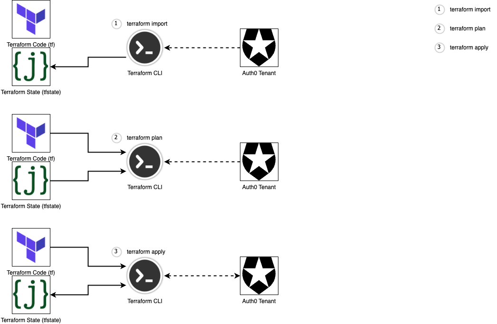

autoscale: true
footer: © Zühlke 2023
slidenumbers: true


# Mastering _**Auth0**_ with _**Terraform**_

## An **IoC** approach to Auth0 Configuration Management

#### by _**Kevin Lin**_

---


# [fit] **_1. Introduction_**

> "The best way to learn is to teach."

^
- My current role in project, joy from learnings from technical work
- The best way of learning is by teaching
- This talk is a pure tech take, not in depth, but practical
- Anyone with basis DevOps knowledge can easily grasp it, and can use the code sample to apply their projects
- Problem/Solution - Demo - Learnings

---


# _**Terraform**_
## [https://www.terraform.io/](https://www.terraform.io/)

- A tool for infrastructure as code (IaC) that define and manage cloud infrastructure in a declarative way
- Allows users to describe the desired state of their infrastructure in code using a high-level language (HCL)
- Helps make infrastructure management more efficient, reliable, and consistent
  - Version-control your infrastructure
  - Collaborate with others
  - Automate your infrastructure management

^ 
* Infrastructure as Code (IaC) is a practice of managing and provisioning infrastructure through code instead of manual processes
* IaC allows for greater consistency, repeatability, and scalability in managing infrastructure, reducing the risk of errors caused by manual configuration.
* Common tools include Terraform, CloudFormation, and Ansible.

---


# _**Auth0**_
## [https://auth0.com/](https://auth0.com/)

- Cloud-based identity platform for authentication and authorization services
- Add secure authentication and authorization capabilities to web, mobile, and legacy applications
- Offers customizable login pages, advanced features such as role-based access control and SSO, and integrations with third-party services
- Provides developer-friendly tools and SDKs for easy integration with different programming languages and frameworks, and offers built-in security features.

---


# [fit] _**2. The Problem**_
# How Auth0 should _**not**_ be managed

^
* Share a real project story
* Common problems and struggles with managing Auth0 configurations
* The importance of repeatability and consistency in managing Auth0 configurations
* Potential security risks and operational issues with manual or ad hoc management approaches

---


# [fit] 😀
# At the beginning, everything is simple and easy!

 Patient App | Doctor App | Admin App |
:-----------:|:----------:|:---------:|
     SIT     |    SIT     |    SIT
             |            |

---


# [fit] 😅
# Then comes UAT, which doubles the configurations ...

Patient App | Doctor App | Admin App |
:----------:|:----------:|:---------:|
  SIT       |    SIT     |    SIT
  UAT       |    UAT     |    UAT
            |            |

---


# [fit] 😰
# And then, Production need to be setup to go life!
## Best news: we don't have admin access this time!!

Patient App | Doctor App | Admin App |
:----------:|:----------:|:---------:|
  SIT       |    SIT     |   SIT
  UAT       |    UAT     |   UAT
**PROD**    |  **PROD**  | **PROD**

^
- You can see the problems here:
1. Every config change will need to be applied 3 times
2. As 10+ people have admin access, no way to track what was changes, who made the change 

---


# [fit] 😡
# Lastly, we need to support Staging!!!

Patient App | Doctor App | Admin App |
:----------:|:----------:|:---------:|
  SIT       |    SIT     |   SIT
  UAT       |    UAT     |   UAT
  STG       |    STG     |   STG
**PROD**    |  **PROD**  | **PROD**

---


# [fit] _**3. The Solution**_
# And how to start in 3 simple steps

^
- How Terraform can be used to manage Auth0 configurations effectively
- Key benefits of using Terraform with Auth0, including improved consistency, security, and scalability
- A detailed explanation of how Terraform can be used to manage Auth0 configurations

---


# #1 Connect to Auth0 Management API

1. Create a Machine to Machine (M2M) Application in Auth0 with the right permissions 
1. Setting Auth0 environment variables

```shell
export AUTH0_DOMAIN=***********
export AUTH0_CLIENT_ID=***********
export AUTH0_CLIENT_SECRET=***********
```

^
- These commands connects the TF CLI on your local to the target Auth0 tenant

---


# #2 Configure your Terraform module 

Configure the Provider in `main.tf`

```json
terraform {
  required_providers {
    auth0 = {
      source  = "auth0/auth0"
      version = "~> 0.43.0"
    }
  }
}

provider "auth0" {}
```

---


# #3 Initialise your Terraform module

Run the command from the module folder:

```shell
terraform init
```

And you are ready to go!

---


# Auth0 Resource in Terraform - Client

```json
resource "auth0_client" "admin_app" {
  allowed_clients      = []
  allowed_logout_urls  = [...]
  allowed_origins      = []
  app_type             = "spa"
  callbacks            = [...]
  client_aliases       = []
  client_metadata      = {}
  cross_origin_auth    = false
  custom_login_page_on = true
  grant_types = [
    "authorization_code",
    "refresh_token",
    "password",
    "http://auth0.com/oauth/grant-type/password-realm",
  ]
  is_first_party                      = true
  is_token_endpoint_ip_header_trusted = false
  name                                = "Admin App"
  oidc_conformant                     = true
  sso                                 = false
  sso_disabled                        = false
  token_endpoint_auth_method          = "none"
  web_origins                         = [...]

  jwt_configuration {
    alg                 = "RS256"
    lifetime_in_seconds = 36000
    scopes              = {}
    secret_encoded      = false
  }

  refresh_token {
    ...
  }
}
```

---


# Auth0 Resource in Terraform - SMS Connection

```json
resource "auth0_connection" "sms" {
  is_domain_connection = false
  metadata             = {}
  name                 = "sms"
  strategy             = "sms"

  options {
    allowed_audiences              = []
    api_enable_users               = false
    auth_params                    = {}
    brute_force_protection         = true
    ...
    from                           = "+12184223634"
    import_mode                    = false
    ips                            = []
    name                           = "sms"
    non_persistent_attrs           = []
    pkce_enabled                   = false
    requires_username              = false
    scopes                         = []
    scripts                        = {}
    sign_saml_request              = false
    strategy_version               = 0
    syntax                         = "md_with_macros"
    template                       = <<-EOT
            Your verification code is: @@password@@
        EOT
    twilio_sid                     = "***********"
    twilio_token                   = "***********"
    ...

    totp {
      length    = 6
      time_step = 180
    }
  }
}
```

---


# Auth0 Resource in Terraform - Email Provider

```json
resource "auth0_email" "smtp_email_provider" {
  default_from_address = "support@nextgen.com"
  enabled              = true
  name                 = "smtp"

  credentials {
    smtp_host = "email-smtp.ap-southeast-1.amazonaws.com"
    smtp_port = 587
    smtp_user = "***********"
    smtp_pass = "***********"
  }
}

resource "auth0_connection_client" "sms_conn_patient_app_assoc" {
  depends_on    = [auth0_connection.sms, auth0_client.native_app]
  connection_id = auth0_connection.sms.id
  client_id     = auth0_client.native_app.id
}
```

---


# [fit] _**4. Code Demo**_##

### [https://github.com/kevinlin/auth0-configuration-demo](https://github.com/kevinlin/auth0-configuration-demo)

^
- Plan to start on the next big thing, name it NextGen
- Has both mobile and web app, support SMS and email OTP

---


# [fit] _**5. Lessons Learned**_
# Best practices to master Auth0 configuration

---


# Store Terraform state files as code

1. Snapshot of Auth0 configurations
1. Contains UUIDs that enables TF to retrieve the latest and compare
1. Output any resource object from state in standard HCL format

```shell
terraform import auth0_client.web_client AaiyAPdpYdesoKnqjj8HJqRn4T5titww
terraform state show auth0_client.web_client
```

---


# Import Existing Configurations from Auth0 first



---


# Use TF Workspace to manage multiple environments

Together with TF variables, you manage multiple environments with the same TF module: 

```shell
terraform workspace list
terraform workspace select sit
terraform workspace new uat

terraform plan -var-file=$(terraform workspace show).tfvars
terraform apply -var-file=$(terraform workspace show).tfvars
```

^
- Allows you to do command substitution

---


# Encrypt Sensitive Data
- [https://github.com/mozilla/sops](https://github.com/mozilla/sops)
  - Open source tool that helps teams manage secrets securely
  - Supports various encryption formats and cloud providers
- [terraform-sops](https://github.com/carlpett/terraform-provider-sops) - A TF plugin for using files encrypted with sops

^ 
Terraform doesn't provide an official solution for encryption
gpg --full-generate-key
gpg --list-keys
gpg --armor --output sops_key.asc --export kevin.lin@zuhlke.com
gpg --fingerprint 
export SOPS_PGP_FP="BE5F 7B02 7354 784A CBDD  DBA8 8B77 1DA9 D18D FE84"

---


# Possibilities to apply the same approach

- Go beyond Cloud providers
- Any API service that can be fully managed by RESTful API can be managed by TF, technically
- Okta, Kong gateway, ForgeRock Cloud

---


# [fit] _**Q&A**_ + Invitation

^
- Open floor for attendees to ask questions about the presentation and topics discussed
- Opportunity for attendees to share their experiences with Terraform and Auth0
- Invitation to continue the conversation with the speaker after the session
- Looking forward to your experience on applying the learnings to real client projects
- Thank you to the attendees for their time and attention!