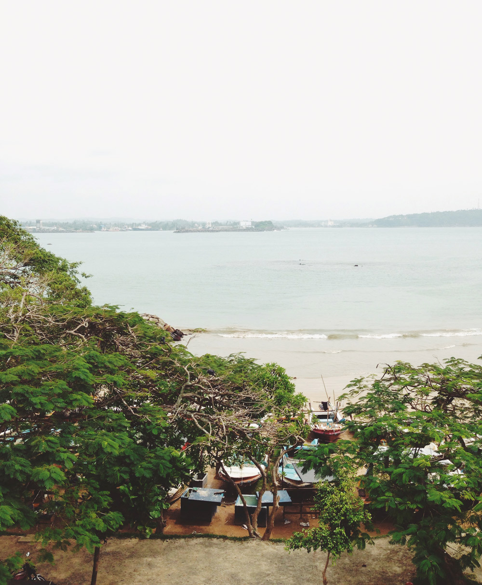
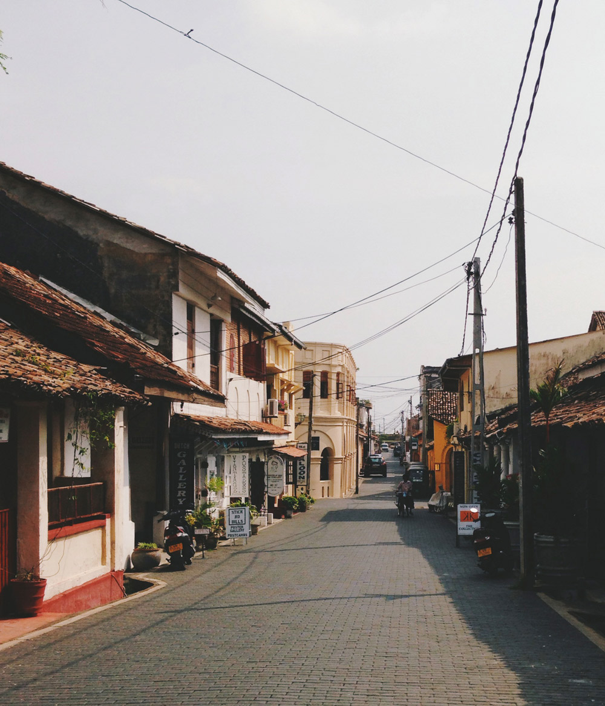
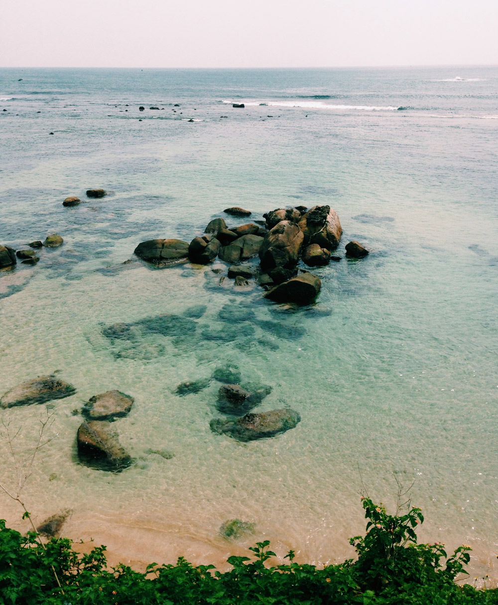
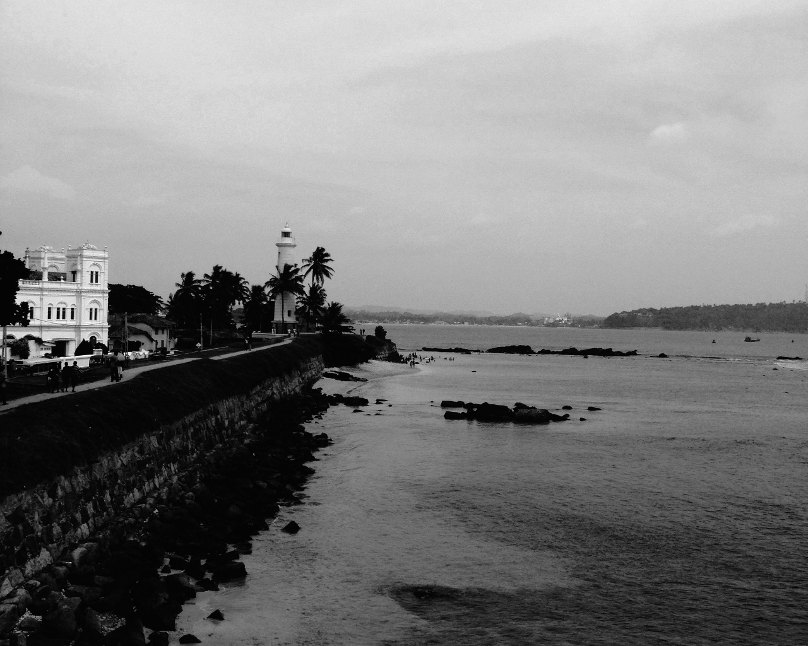

# Working with images
### Deckset has eight great ways to work with images

---

## Deckset works with both local  and web images. Simply drop one onto the Deckset window and the Markdown is automatically created and copied to the clipboard.

---

## You can also add an image by typing the standard Markdown syntax:  ``

---

# Deckset uses eight modifiers to adjust images:

1. Fill is the default behaviour
1. [Fit] an image to your slide
1. [x%] scale an image
1. [Left] aligned
1. [Right] aligned
1. [Inline] within text
1. [Filtered] adds a filter
1. [Original] removes a filter

---

## An image fills the whole slide by default.

---

---

## If text and images are used together, the image is filtered so the text is always readable.

### Each theme uses a unique filter!

---

## Want to see the whole image?

## Add 'fit' between the brackets: [fit], and the image scales to fit the slide.

---

---

## Scale to an exact size using a percentage: [15%]

---

---

## Move an image to the [left].

---

## Or move it to the [right].

---

## Sometimes you might need more than one image on a slide…

## Combine a [left] and a  [right] image.

---

---

## If two isn’t enough, you can add as many images as you like

### We divide the slide horizontally according to the number of images, then fill each space with an image.

---

---

# To combine text and images, add ‘inline’ to the brackets: [inline]. All inline images are centered, and fit the available space by default.

---

# [Inline] images can be moved by using [inline, left] or [inline, right].

---

# Create grids by using multiple lines of [inline, fill] images.

  

---

Add text underneath an [inline] image for dead simple image + caption slides.

---

## When used within a line of text [inline] images fit to the height of the text  .

---

## Apply a filter to any image with [filtered].

---

## On text and image slides filters can be overridden with [original] if they are not needed.

---

### Get creative by combining a few effects:

---

### Works great with logos:

---

### You can create  magazine-like layouts:

