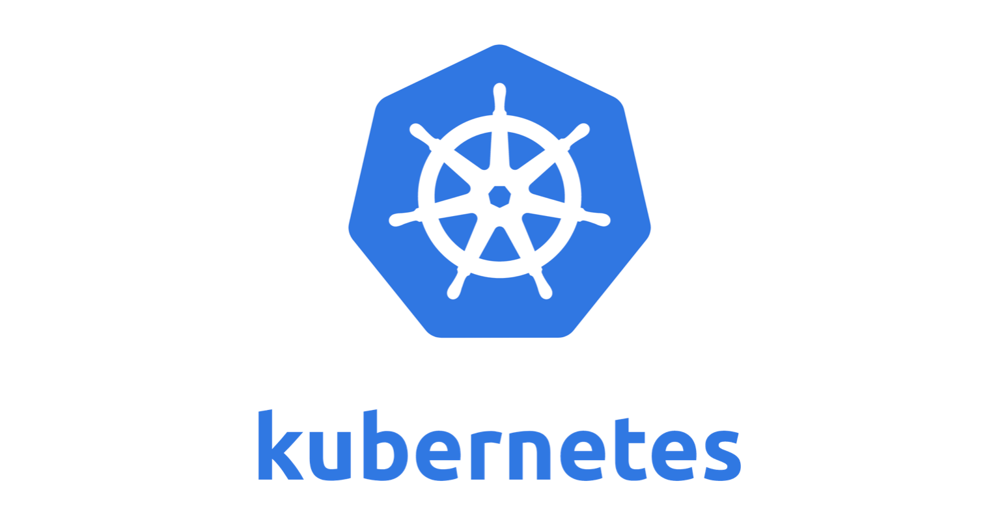

autoscale: true
footer: Zuhlke Engineering Asia
slidenumbers: true

# _From_ Code _to_ **_Cloud Native_**

### How DevOps works in a enterprise project

#### by _**Kevin Lin**_, _**Kin Yung Cheung**_

^ Today Kin and I are  going to talk about xxx. 
As a project team, every engineer should know the basics of docker/kubernetes
Raise interest to inspire some of you to take up trainings
For the sceenshots, we are going to use whatever is avaialbe 

---

# [fit] Containerization

---

# Why is Docker the De facto?
- Docker image
  - Build once, Run everywhere
  - An application archive including base OS and software dependencies
  - Perfect solution for application packaging
- Developer friendly
  - Every developer can do DevOps now

  
---

#[fit]  Sample dockerfile

---

# What happens when Docker get busy?

---

#[fit] What is _**Kubernetes**_ for?

---

# Kubernetes - Cloud Native Computing Foundation (CNCF)
- Year 2015 - Kubernetes 1.0 released by Google
  - Contributed to the Linux Foundation as a seed technology
- Cloud Native Computing Foundation (CNCF) was founded by Google, CoreOS, Mesosphere, Red Hat and others
  - CNCF attracts a fast growing container community around Kubernetes
  - CNCF incubate many popular open source projects like: Prometheus, Fluentd, OpenTracing, CNI, Istio

---

# Kubernetes in Summary
- Everything in Kubernetes are API objects
  - Master
  - Node
  - Pod
  - Deployment
  - Service
  - Secret
  - ...

---

---

#[fit]  Bitbucket pipeline

---

# Helm Chart
## Why?

---

# [fit] Chart library

---

# [fit] Alternatives: Kustomize

---

# [fit] GitOps Repo Pattern
# Why? How?

---

# [fit] ArgoCD
## Why? How?

---

# ArgoCD Live showcase

---

# Advanced topics

---

# Configuration management
- ConfigMap vs config service vs env vars

---

# Secret management
- Sealed Secret

---

# [fit] What's Next?

---

- Operation dashboard
- Logging: Fluent Bit + CloudWatch
- App Performance Monitoring: Prometheus + Grafana
- Distributed tracing: Zipkin, xxx

---

# [fit] Why Rancher?
- Rancher vs K9s

---

# [fit] What exactly is **_Kubernetes_**?

---

# Kubernetes is not a better version of Docker
- Container runtime agnostic
    - It uses Docker by default
- Provide container orchestration like Docker Compose + Swarm
    - And much, much more

---

## Control the playback by using:

* `[autoplay]` to start playing the video straight away
* `[loop]` to loop the video
* `[mute]` to mute the video

