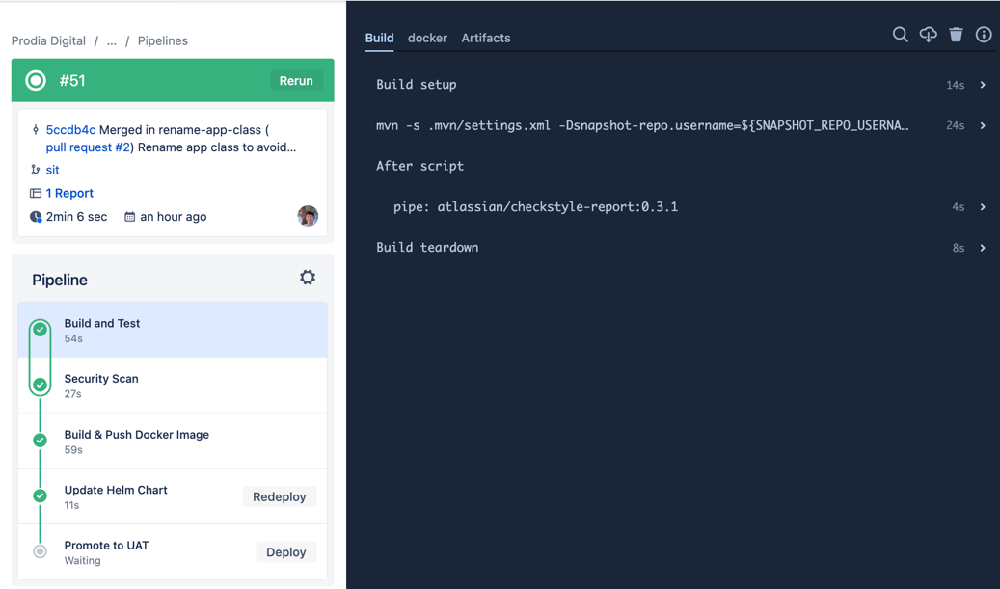
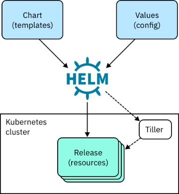

autoscale: true
footer: Zuhlke Engineering Asia
slidenumbers: true

# _From_ Code _to_ **_Cloud Native_**

### How DevOps works in a Enterprise Project

#### by _**Kevin Lin**_, _**Kin Yung Cheung**_


^ Today Kin and I are going to talk about xxx.
As a project team, every engineer should know the basics of docker/kubernetes
Raise interest to inspire some of you to take up trainings
For the sceenshots, we are going to show whatever is used in Prodia project

---

# I have written a Java API Service

# What's next?

^ Kevin act as Java developer and asking the question: what does it take to deploy to the Cloud?
We want to make it public accessible?
Kin:

---

# [fit]Put it in a _**Container**_

# [fit]or simply a _**Docker**_

^ An application archive including base OS and software dependencies

1. Isolation (namespace)
1. Limitation (cgroups)
1. Simulation (fsroot)

---

# Typical dockerfile for a SpringBoot microservice

```yaml
--
FROM amazoncorretto:18-alpine-jdk

ARG JAR_FILE=target/*.jar
COPY ${JAR_FILE} app.jar

EXPOSE 8080

ENTRYPOINT ["java","-jar","/app.jar"]
--
```

---

# What need to done for Docker that is deployable

1. Run the Docker command to build the image
1. Security scan on the image for CVE
1. Publish to a docker registry, i.e.

- Dockerhub
- AWS ECR
- etc

^ Kevin: How do I make sure these steps are run every time correctly?

---

# Continuous Integration (CI) platform comes to rescue

- Jenkins / CloudBees (for on-prem environment, most)
- GitHub Actions
- Bitbucket Pipeline
- CircleCI

---

# Bitbucket Pipeline

- Comes bundled with Bitbucket



---

# CI Flow


---

# Sample Bitbucket Pipeline for Java API Service (Partial)

```yaml
definitions:
  steps:
    - parallel: &unit-Test
        - step:
            name: Build and Test
        - step:
            name: Security Scan
    
    - step: &build-artifact-and-deploy
        name: Build Image and Update Helm Chart
    
    - step: &promote-to-env

pipelines:
  default:
    - parallel: *unit-Test
  branches:
    sit:
      - parallel: *unit-Test
      - step:
          <<: *build-artifact-and-deploy
          deployment: sit
      - step:
          <<: *promote-to-env
          name: Promote to UAT
          trigger: manual
          deployment: uat
```

---

# Where do we deploy the docker image?

# And how do we do that?

1. Host it on a single server

- AWS EC2
- GCP Compute Instance Cloud

Is it good enough for you?

^ Kin to explain why we need a container orchestration system like K8s

---

## How do you make sure the docker is running properly?

### - What happens when it crashes?

## What if we want to have multiple instances to scale it up?

### - What happens when one of our service went down?

## What if we want to have many services running together in the target environment?

### - Would it be cool to auto-scale when the service is under load?


---

# How containers work in real world


---

#[fit] Let's talk about _**Kubernetes**_

* Orchestration system for automating container deployment, scaling, and management
* Original introduced by Google, now maintained by CNCF
* De-factor standard to deploy and operate containerized applications

^ Kevin: I have heard of Kubernetes. What's the difference between Docker and Kubernetes? Is k8s an evolutaion of Docker?

---

## Control Plane vs Work Nodes


---

# Different flavors of _**Kubernetes**_:

- Local: Minikube, e3s
- Self-managed Kubernetes
- On-prem/Private Cloud: OpenShift
- Managed Kubernetes service from Cloud: EKS, GKE, AKS, DigitalOcean etc

---

# Kubernetes in Summary

- Everything run in Kubernetes are resource objects
    - Pod
    - Deployment
    - Service
    - Ingress
    - ConfigMap
    - Secret
    - ...

^ Kevin: What exact is a Pod? Is it another name for a container?

---


---

# [fit] Live Demo of

# [fit]_**Kubernetes**_

^ Demo Rancher: node -> namepace -> workload -> deployment -> pod
Pause for questions
Explain Rancher, demo again using K9s

---

# How exactly do I deploy to _**Kubernetes**_ Cluster?

1. Manually via `kubectl`
1. Via a Continuous Deployment (CD) platform

- ArgoCD
- Flux CD
- Octopus Deploy
- Spinnaker

---

# Helm Chart



^ - Deploy multiple services with similar deployment YAML

- You need a number of YAML files, below is the minimum for a typical microservice
    1. deployment
    2. service
    3. ingress
- Managing the files for many similars service introduce a huge maintenance overhead
- Intorducting templating and variable replacement

---

# Helm Chart & _**Kustomize**_

**_Helm3_** is an **imperative templating** tool for managing Kubernetes packages called charts.

- Charts are a templated version of your yaml manifests with a subset of Go Templating mixed throughout.
- Chart is also a package manager for kubernetes that can package, configure, and deploy/apply the helm charts onto kubernetes clusters.

**_Kustomize_**: is a **declarative tool**, which works with yaml directly and works as a stream editor like sed.

^ Kustomize traverses a Kubernetes manifest to add, remove or update configuration options without forking.

- It is a very K.I.S.S. approach and doesn’t add additional abstraction layer at all. It permits you to add logic into YAML, that’s all.
- It is a purely declarative approach to configuration customization.
- It runs as a standalone binary, as a stream editor like sed, which makes it perfect for CI/CD pipelines.

---

# `service.yaml`

```yaml
{{- define "library-chart.service.tpl" -}}
{{- $requiredMsg := include "library-chart.default-check-required-msg" . -}}
apiVersion: v1
kind: Service
metadata:
  name: {{ include "library-chart.name" . }}
  labels:
          {{- include "library-chart.labels" . | nindent 4 }}
spec:
  type: {{ (.Values.service).type | default "ClusterIP" | quote }}
  ports:
    - port: {{ (.Values.service).port | include "default.port" }}
      targetPort: {{ (.Values.service).targetPort | default "8080"  }}
      protocol: TCP
      name: http
  selector:
      {{- include "library-chart.selectorLabels" . | nindent 4 }}
    {{- end -}}
    {{- define "library-chart.service" -}}
    {{- include "library-chart.util.merge" (append . "library-chart.service.tpl") -}}
    {{- end -}}
```

---

# `values-sit.yaml`

```yaml
image:
  tag: "hello-world-api-poc-ee2a450c"

service:
  path: sample-api

replicas: 1
config:
  application.yml: |-
    greeting:
      message: Say Hello to the World 123
    farewell:
      message: Say Goodbye
```

---

# [fit] GitOps

**What is GitOps?**
GitOps is an **operational framework** that takes DevOps best practices used for application development and applies them to infrastructure automation.

**What is GitOps used for?**
GitOps is used to automate the process of provisioning infrastructure. DevOps teams that adopt GitOps use configuration files stored as code (infrastructure as code).

**How does GitOps work?**
GitOps configuration files generate the same infrastructure environment every time it’s deployed, just as application source code generates the same application binaries every time it’s built.

---

# ArgoCD
### Continuous deployment to kubernetes made easy
1. Declarative approach
   - I want 2 replicas, 1 ingress controller and 1 config map for service A
   - 3 replicas, 1 secret and 1 persistent storage for service B
2. Keep the deployement exactly as I describe the target state in git
3. If anyone has manually changed the deployment, rollback to the state described in git 

---

# [fit] ArgoCD Live Demo

---

# [fit] K9s

- Rancher is great but 
  - I have to install it in my cluster and it is a pain to install
  - it takes up pod space in my cluster
  - it has tons of features but I just want to know what's running in my clusters
  - I like commmand line

---

# [fit] What's Next?

---
# Advanced topics

- Configuration management
    - ConfigMap vs config service vs env vars
- Secret management
    - Sealed Secret
- Operation dashboard
- Logging: Fluent Bit + CloudWatch
- App Performance Monitoring: Prometheus + Grafana

---


