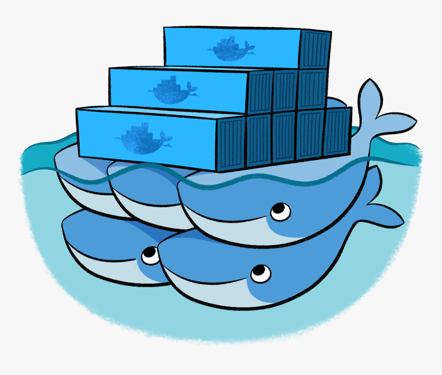

autoscale: true
footer: Zuhlke Engineering Asia
slidenumbers: true

# _From_ Code _to_ **_Cloud Native_**

### How DevOps works in a Enterprise Project

#### by _**Kevin Lin**_, _**Kin Yung Cheung**_


^ Today Kin and I are  going to talk about xxx. 
As a project team, every engineer should know the basics of docker/kubernetes
Raise interest to inspire some of you to take up trainings
For the sceenshots, we are going to show whatever is used in Prodia project 

---

# [fit] Containerization

^ Kevin act as Java dveloper and asking the question: 
Kin: 

---

# Typical dockerfile for a SpringBoot microservice
```yaml
--
FROM amazoncorretto:18-alpine-jdk

ARG JAR_FILE=target/*.jar
COPY ${JAR_FILE} app.jar

EXPOSE 8080

ENTRYPOINT ["java","-jar","/app.jar"]
--
```

---

# What need to done for Docker that is deployable
1. Build the docker image
1. Run security scan on the image for CVE
1. Publish to a docker registry
  - Dockerhub
  - AWS ECR
  - etc

---

# Where a Continuous Integration (CI) platform comes in
- Jenkins / CloudBees (for on-prem environment, most)
- GitHub Actions
- Bitbucket Pipeline
- CircleCI

---

# Bitbucket Pipeline

- Comes bundled with Bitbucket


---

# CI Flow


---

# [fit] How do we deploy the docker image?
1. Host it on a server
  - AWS EC2
  - GCP Compute Instance Cloud
  - Is it a good idea?

^ Kin to explain why we need a container orchestration system like K8s

---

## How do you make sure the docker is running properly?
### What if it crashes?
### What if we want to have multiple instances to scale it up? Would it be cool to auto-scale?
### What happens when one of our service went down?
## What if we want to have many services running together in the target environment?



---

#[fit] What is _**Kubernetes**_?
* Orchestration system for automating container deployment, scaling, and management
* Original introduced by Google, mow maintained by CNCF

---

# Kubernetes in Summary
- Everything in Kubernetes are API objects
  - Master
  - Node
  - Pod
  - Deployment
  - Service
  - Secret
  - ...

---


---

# [fit] Live Demo of _**Kubernetes**_

^ Different flavors of K9s:
- Local - minikube/e3s
- Self-managed K8s: master node
- On-prem/Private Cloud: OpenShift
- Managed K8s service from Cloud: EKS, GKE, AKS

---

# How do I deploy to Kubernetes Cluster?
1. Manually via `kubectl`
1. Via a Continuous Deployment (CD) platform
  - ArgoCD
  - Flux CD
  - Octopus Deploy
  - Spinnaker

---

# Helm Chart
## Why?

---

# [fit] Chart library

---

# [fit] Alternatives: Kustomize

---

# [fit] GitOps Repo Pattern
# Why? How?

---

# [fit] ArgoCD
## Why? How?

---

# ArgoCD Live showcase

---

# Advanced topics

---

# Configuration management
- ConfigMap vs config service vs env vars

---

# Secret management
- Sealed Secret

---

# [fit] What's Next?

---

- Operation dashboard
- Logging: Fluent Bit + CloudWatch
- App Performance Monitoring: Prometheus + Grafana
- Distributed tracing: Zipkin, xxx

---

# [fit] Why Rancher?
- Rancher vs K9s

---

# [fit] What exactly is **_Kubernetes_**?

---

# Kubernetes is not a better version of Docker
- Container runtime agnostic
    - It uses Docker by default
- Provide container orchestration like Docker Compose + Swarm
    - And much, much more

---

## Control the playback by using:

* `[autoplay]` to start playing the video straight away
* `[loop]` to loop the video
* `[mute]` to mute the video


