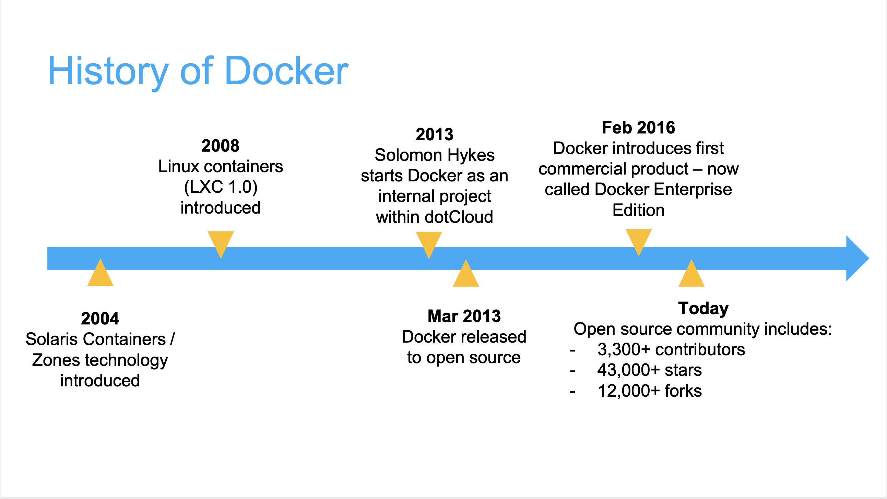

autoscale: true
footer: Zuhlke Engineering Singapore
slidenumbers: true

# [fit] Docker & Kubernetes 101 - Part I
# [fit]
# _
# [fit] Rise and Fall of a Little Whale
## [fit]
## _
## by _**Kevin Lin**_

---

# Cloud Computing is still very much new and evolving
- PaaS, container
- If you don't know Docker and Kubernetes, you don't know container

---

# [fit] Let's take a look back at year 2013 ...

---

# Year 2013
- Cloud computing is mostly about IaaS
- PaaS is ready to take off
- Big players have gone through the conceptualization and user education part
- Cloud Foundry, Pivotal, Red Hat, Heroku...


___

## A start-up called dotCloud released open source project
## It took the PaaS industry by storm


---

## Docker Image is the key to its success
- An application archive
- A sandbox execution (container)
- Including base OS filesystem, and lib executables

```shell
docker run -it ubuntu
```

---

# [fit] Build once
# [fit] Run everywhere

---

# Virtual machine (VM)
### runs a full-blown “guest” operating system
### with virtual access to host resources through a hypervisor


---

# Container
### runs natively on Linux
### shares the kernel of the host machine with other containers


---


^ You take the red pill - you enter into native cloud computing land and I show you how deep the rabbit-hole goes.

---

# What exactly is a Container?
## A _contained_ Linux process
1. Isolation (Linux Namespace)
1.1 PID Mount Namespace
1.2 Mount Namespace
1.3 Network Namespace
1.4 User Namespace
1. Limitation (Cgroups)
1. Simulation (fsroot)

---

# Isolation - Linux Namespace
## Isolate what the process can see, so it lives in its own world
1. PID Mount Namespace
1. Mount Namespace
1. Network Namespace
1. User Namespace
1. UTS
1. IPC

___

# Limitation - Linux Control Group
## Set a limit the resources (CPU, memory, I/O) a process can consume

```shell
$ mount -t cgroup
cpuset on /sys/fs/cgroup/cpuset type cgroup (rw,nosuid,nodev,noexec,relatime,cpuset)
cpu on /sys/fs/cgroup/cpu type cgroup (rw,nosuid,nodev,noexec,relatime,cpu)
cpuacct on /sys/fs/cgroup/cpuacct type cgroup (rw,nosuid,nodev,noexec,relatime,cpuacct)
blkio on /sys/fs/cgroup/blkio type cgroup (rw,nosuid,nodev,noexec,relatime,blkio)
memory on /sys/fs/cgroup/memory type cgroup (rw,nosuid,nodev,noexec,relatime,memory)
...
```

---

# Simulation - rootfs
## Make the container process behave like an isolated OS
## Note: The Linux kernel is never changed, it is always the host kernel
1. Mount root folders: `/bin`，`/etc`，`/proc`
1. Sometimes, mount the full OS filesystem, i.e. Ubuntu16.04 ISO
1. Change root to the new process root folder
1. The filesystem changes are applied in layers

```shell
docker image inspect ubuntu:latest
```

---


---

# Year 2014
## Docker is one step away from taking over the world
## CaaS = PaaS with docker
1. docker build
1. docker compose
1. docker swamp

---



---

---

# Videos

You can add videos to your slides, and control the layout just like you do with images. 

Both *local files* and *YouTube links* playback.


---

## Control the playback by using:

* `[autoplay]` to start playing the video straight away
* `[loop]` to loop the video
* `[mute]` to mute the video


