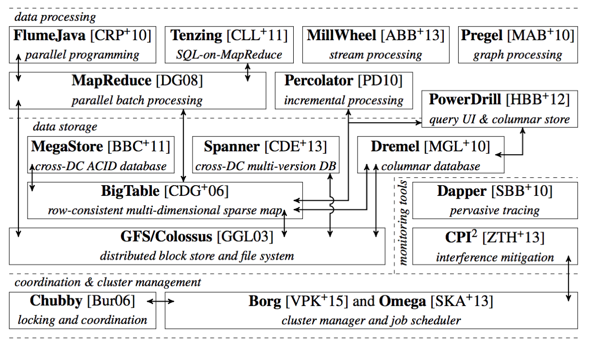

autoscale: true
footer: Zuhlke Engineering Singapore
slidenumbers: true

# Docker & Kubernetes 101 - Part I
# |
# |
# [fit] Rise and Fall of a Little Whale
# |
# |
- by _**Kevin Lin**_


---

# Exciting Age for Containerisation
- The world of Cloud Computing is fast evolving in recent years
- Container technology is the future
    - Docker and Kubernetes are the driving force
    - Microservice architecture become widely accepted
    - Thriving ecosystems, active communities, huge developer interests

---

> Cloud native technologies empower organizations to build and run scalable applications in modern, dynamic environments such as public, private, and hybrid clouds.
> Containers, service meshes, microservices, immutable infrastructure, and declarative APIs exemplify this approach.
> ...
-- Cloud Native Definition by [Cloud Native Computing Foundation](https://www.cncf.io/)

---

# What happened in year 2013 that start this ...

^ Let's wind back time a bit, and look at what happened in year 2013 that start the whole evolution.

---

# Year 2013
- PaaS is the hot topic and just about to take off
- Big players have gone through the conceptualization and user education part
- Cloud Foundry, Pivotal, Red Hat, Heroku...


___

# Docker was open sourced
- It took the PaaS industry by storm
- The whole community quick shift behind docker, probably even to its creator's surprise
- What did it do right?


^ Docker was released as a open source project by a small start-up called dotCloud from San Francisco back then

---

# What did Docker do right?
- Docker image
    - Build once, Run everywhere
    - An application archive including base OS and software dependencies
    - Perfect solution for application packaging
- Docker Hub
    - npm repo for Docker images
- Developer friendly
    - Every developer can do DevOps now

---

# Demo

```shell
docker run -it ubuntu

docker run -dp 80:80 gscho/linux_tweet_app

docker run -dp 80:80 dockersamples/101-tutorial
```

^ Now let's look at some command to showcase how easy it is run a docker of Ubuntu

---

# Virtual machine (VM)
### runs a full-blown “guest” operating system
### with virtual access to host resources through a hypervisor


---

# Container
### runs natively on Linux
### shares the kernel of the host machine with other containers


^ Is it true that container is a lightweight virtualization? Well, you need to make a choice first...

---


^ You take the red pill - you enter into containerisation world, and I show you how deep the rabbit-hole goes.

---

# Container is a **_contained_** Linux process
## Implmented using core Linux kernel features
1. Isolation (namespace)
1. Limitation (cgroups)
1. Simulation (fsroot)

---

# Isolation - Linux Namespace
## Isolate what the process can see, so it lives in its own world
1. PID Mount Namespace
1. Mount Namespace
1. Network Namespace
1. User Namespace
1. UTS
1. IPC

^ cgroups (abbreviated from control groups) is a Linux kernel feature that limits, accounts for, and isolates the resource usage (CPU, memory, disk I/O, network, etc.) of a collection of processes.
Engineers at Google started the work on this feature in 2006, and was merged into the Linux kernel in January 2008.
___

# Limitation - Linux Control Group
## Set a limit the resources (CPU, memory, I/O) a process can consume

```shell
$ mount -t cgroup
cpuset  on /sys/fs/cgroup/cpuset type cgroup (rw,nosuid,nodev,noexec,relatime,cpuset)
cpu     on /sys/fs/cgroup/cpu type cgroup (rw,nosuid,nodev,noexec,relatime,cpu)
cpuacct on /sys/fs/cgroup/cpuacct type cgroup (rw,nosuid,nodev,noexec,relatime,cpuacct)
blkio   on /sys/fs/cgroup/blkio type cgroup (rw,nosuid,nodev,noexec,relatime,blkio)
memory  on /sys/fs/cgroup/memory type cgroup (rw,nosuid,nodev,noexec,relatime,memory)
...
```

---

# Simulation - rootfs
## Make the container process behave like an isolated OS
## Note: The Linux kernel of the host never change
1. Mount root folders: `/bin`，`/etc`，`/proc`
1. Sometimes, mount the full OS filesystem, i.e. Ubuntu16.04 ISO
1. Change root to the new process root folder
1. The filesystem changes are applied in layers

```shell
docker image inspect ubuntu:latest
```

---


---

# Year 2014
- Docker was the leader in container technology
    - Docker Compose - Orchestration on multiple containers with dependencies
    - Docker Swarm - Container cluster manager
    - The company behind Docker dotCloud changed its name to Docker
- It appeared that Docker is going to be the winner of **Container-as-a-Service** market


---

# Year 2015
- Kubernetes 1.0 released by Google
- Cloud Native Computing Foundation (CNCF) was founded by Google, CoreOS, Mesosphere, Red Hat and others
    - CNCF attracts a fast growing container community around Kubernetes
    - CNCF incubate many popular open source projects like: Prometheus, Fluentd, OpenTracing, CNI, Istio

---

# And the rest is history
- 2015
    - Kubernetes surpass Docker quickly, and never looked back
- 2016
    - Docker embedded Swarm directly inside Docker Engine
    - Docker refused a bid from Microsoft to buy it for $4 billion
- 2017
    - **Docker** (open source project) renamed to **Moby** 
    - Docker embedded Kubernetes in its own product
- Current
    - The container ecosystem is build around Kubernets


---

# [fit] What exactly is **_Kubernetes_**?

---

# Kubernetes is not a better version of Docker
- Container runtime agnostic
    - It uses Docker by default
- Provide container orchestration like Docker Compose + Swarm
    - And much, much more

---

# Kubernetes is not just open source project
- Successor of Borg & Omega, Google's secret weapon
- Designed to manage large-scale computing cluster,
- That powers Google search, Gmail


---

> “Operating system support for warehouse-scale computing”. PhD thesis, Chapter 2.
-- Malte Schwarzkopf, University of Cambridge Computer Laboratory, 2015

---



---

# Think Kubernetes as an OS of a cluster of hosts
- Everything in Kubernetes are defined as API objects
    - Pod
    - Service
    - Deployment
    - Every component are configurable
- Pod is the most basic unit
    - Group of containers closely associated
    - Docker is always a single process
- Let user define pods, and the complex associations between them
    - And manage the state and associations 

---

# [fit] To be continued

---


# Videos

You can add videos to your slides, and control the layout just like you do with images. 

Both *local files* and *YouTube links* playback.


---

## Control the playback by using:

* `[autoplay]` to start playing the video straight away
* `[loop]` to loop the video
* `[mute]` to mute the video


