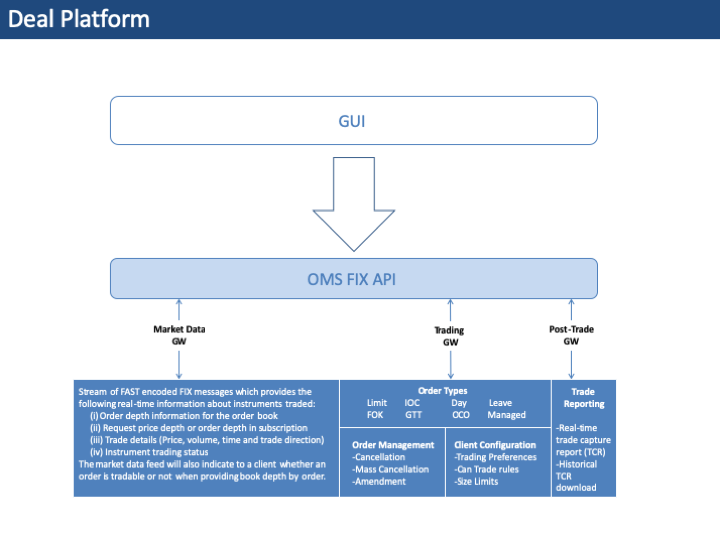

autoscale: true
footer: Zuhlke Engineering Singapore
slidenumbers: true

# [fit] FIX Messaging
# [fit] by **_Kevin Lin_**

---

# What I want to talk about FIX?

This tech talk is for engineers with little or no prior knowledge on FIX. 
It aims to provide a basic understanding of FIX message structure, type of message, message flow and the programming model.

---

# [fit] What is FIX?

---


---

# **_F_**inancial **_I_**nformation e**_X_**change

A electronic communications protocol for international **_real-time_** exchange of **_securities transaction_** information. 

Used by the FIX community which includes nearly 300 member firms including **_all major investment banks_**.

The de-facto messaging standard for **_front office messaging_**. It is used for pre-trade, trade, and post-trade communication.

^ Have anybody head the name SWIFT? SWFIT is the standard for back office messaging, FIX is the standard for front office messaging.

---

# Characteristic of FIX
- Simple, plain text, field-based text messages
- Platform and Transport independent, compatible with almost every common network technology
- Public standard
    - Owned & managed by [FIX Protocol Ltd](https://www.fixtrading.org/), a non-profit financial community organization
- Wide support and lots of software vendors availability

---

> The FIX Protocol was originally authored in 1992 to enable electronic communication of equity trading data between Fidelity Investments and Salomon Brothers.
-- by Robert "Bob" Lamoureux and Chris Morstatt

^ Now let's look back how FIX was invented

---

### Fidelity realized that information from their broker-dealers could be routed to the wrong trader, or simply lost when the parties hung up their phones.
### It wanted such communications to be replaced with machine-readable data


^ 

---

## Strict syntax, machine parsable while remain textual
## Extensible, support all current and future trading activities
## Concise, use less characters to conserve bandwidth

^ XML? No, too verbose
JSON? No good way to enforce syntax/schema
Protobuf? Probobaly

---

# Buy 5000 IBM @ 110.75


---

# Buy 5000 IBM @ 110.75
## _[A fund manager] tells [A broker] I'm willing to_ Buy 5000 _units of_ IBM _shares at the price of_ 110.75 _dollars right now_


---

## Buy 5000 IBM @ 110.75
### _[A fund manager] tells [A broker] I'm willing to_ Buy 5000 _units of_ IBM _shares at the price of_ 110.75 _dollars right now_
- Replace each piece of information with a field/tag, identified by a decimal number
- And add additional fields/tags required by machine


---

## Buy 5000 IBM @ 110.75

#### `8=FIX.4.2^9=251^35=D^49=AFUNDMGR^56=ABROKER^34=2^52=20030615-01:14:49^11=12345^21=1^55=IBM^54=1^60=2003061501:14:49^38=5000^40=2^44=110.75^10=127`

| Header fields | Body fields | Trailer Fields
| --- | --- | --- |
| 8=BeginString (indicates FIX 4.2) | 11=ClOrderID (client order id) | 10=Checksum |
| 9=BodyLength | 21=HandleInst (automated exec) | |
| 35=MsgType (new order) | 55=Symbol (IBM) | |
| 49=SenderCompID (AFUNDMGR) | 54=Side (buy) | |
| 56=TargetCompID (ABROKER) | 56=TransactTime | |
| 34=MsgSeqNum (2) | 38=OrderQty (5000) | |
| 52=SendTime | 40=OrdType (Limit) | |
| | 44=Price (110.75) | |
| | 52=SendTime | |

---

## Buy 5000 IBM @ 110.75

##### 8=FIX.4.2^9=251^35=D^49=AFUNDMGR^56=ABROKER^34=2^52=20030615-01:14:49^11=12345^21=1^**_55=IBM_**^**_54=1_**^60=2003061501:14:49^**_38=5000_**^40=2^**_44=110.75_**^10=127

| Header fields | Body fields | Trailer Fields
| --- | --- | --- |
| 8=BeginString (indicates FIX 4.2) | 11=ClOrderID (client order id) | 10=Checksum |
| 9=BodyLength | 21=HandleInst (automated exec) | |
| 35=MsgType (new order) | **_55=Symbol (IBM)_** | |
| 49=SenderCompID (AFUNDMGR) | **_54=Side (buy)_** | |
| 56=TargetCompID (ABROKER) | 56=TransactTime | |
| 34=MsgSeqNum (2) | **_38=OrderQty (5000)_** | |
| 52=SendTime | 40=OrdType (Limit) | |
| | **_44=Price (110.75)_** | |
| | 52=SendTime | |

---

# A brief history of FIX
- Introduced in **1992**
- **1995** - first public spec (FIX 2.7) released
- **1996** - FIX 4.0
    - Introduced with good US equity support (still in use in US)
- **2000** – FIX 4.2
    - Better international support
    - Futures, options, FX
- **2001** – FIX 4.3
    - Fixed income
- **2003** – FIX 4.4
    - Confirmations & trade reporting
- **2006** – FIX 5.0 & FIXT1.1
    - Complex FX, improved session/transport level

---

# Who uses FIX?

- Institutional investors (the buy side)
- Broker/dealers (the sell side)
- Exchanges & Electronic Communication Networks (ECN)
- Financial industry utilities
- Software & services vendors

---

# What/where is it used?
- Financial Products Supported
    - Equities
    - Fixed Income
    - FX
    - Derivatives (Options, Futures, IR Swaps etc)
- Used worldwide
    - Except mainland China :cn:

---

#  How is it used?
- Used by exchanges, ECN, & brokers/ dealers to distribute market data, quotes, etc.
- Money mangers use it to send orders and receive executions from brokers.
- Used by exchanges & ECNs to receive orders or quotes & report trades.
- Used to allocate & confirm trades. 

---

# Variant of FIX
- tagvalue (classic FIX)
- FAST - FIX Adapted for Streaming
    - Binary encoding for reduced bandwidth use and low latency 
- FIXML - XML

---


Typical FIX system architecture

---


Typical FIX system connectivity

---



---

`8=FIXT.1.1^A9=908^A35=y^A49=FIXEDGE^A56=UILNDRGW1^A34=2239^A52=20170309-11:41:49.132^A560=0^A393=1^A320=23387919276913833^A322=23387919276913833_37^A1151=NDF.AFRICA^A893=Y
^A146=1^A55=NDF.USD.UGX.10M^A460=0^A423=106^A32030=0^A32237=17^A32278=1^A32277=1^A32239=2^A32292=1^A32042=0^A32321=1^A32322=2^A32354=1^A32045=2^A32047=10^A32053=2^A32296=309^A32054=0^A32055=1000000^A32352=0^A32355=0^A32356=0^A32357=3^A32358=0^A32359=0^A32360=1^A32361=1^A32362=1^A32316=0^A32344=2^A32404=0^A167=NDF^A762=Variable Start End Date^A965=1^A32223=20170309^A32240=D^A32041=D^A32043=20170313^A32353=20170313^A32046=M^A32048=None^A32050=20180113^A32051=20180116^A32345=REUTERS^A32346=ZMWFIX=TR^A32347=USD^A32348=20180112^A32349=20180112^A32302=11:30:00^A562=0.1^A1140=50^A561=0.05^A32243=1^A32331=500000^A454=2^A455=UGX 10M.NS^A456=3^A455=ForeignExchange:NDF^A456=100^A32293=3^A32044=USD^A32044=UGX^A32044=WKNDS^A32294=3^A32052=USD^A32052=UGX^A32052=WKNDS^A1310=1^A1301=FX.AFRICA^A1205=1^A1206=0^A1207=1500^A1208=0.0001^A1237=1^A40=2^A10=251^A2`


---

# FIX Versioning

FIX currently supports three versions of the application messages that serve as the basis for standardization:

1. Version 5.0 Service Pack 2
    **_FIX.5.0SP2_** is the most current version of FIX that supports multiple asset classes and a wide range of trading life cycle business processes. 
    The FIX session protocol was separated from the application with the introduction of FIX.5.0
1. Version 4.4
    **_FIX.4.4_** is one of the most widely adopted versions oF FIX. FIX.4.4 covers multiple asset classes including fixed income instruments. As of 2010, it is considered compliant to use fields, messages, and components as of the latest extension pack of FIX with FIX.4.4.
1. Version 4.2
    **_FIX.4.2_** is widely used for equities, FX, and listed derivatives trading.

---

# FIX message structure
- Header fields
    - message type, length, sequence number, sender/target, encoding, etc.
- Body fields
    - session & application data
- Trailer fields
    - Signature, checksum

---

# Message fields
- For each field `<Tag>=<Value><Delimiter>` the specification defines:
    - Tag – A unique number.
    - Field Name – Field name with no spaces.
    - Required - Mandatory/optional
    - Description – Definition of data, data type, etc.
- `<Delimiter>` is ASCII SOH character

---

# FIX tag number space

- Public fields (tagNum < 5000)
    - Reserved for standard specifications or extentions
- User defined fields (5000 <= tagNum < 9999)
    - Publicly registered, fully allocated 
    - [User Defined Fields](https://www.fixtrading.org/standards/user-defined-fields/)
- User defined fields (10,000 <= tagNum <= 39999)
    - For bilateral user between parties, do not need to be registered
    
---

# Session & application layers
- Session layer/protocol
    - Make & terminate connections
    - Deliver messages in sequence w/ data integrity
- Application layer
    - Business level messages
- Session & application layers are coupled prior FIX 5.0.

---

# Session Level Messages
1. Logon
1. Heartbeat
1. Test Request
1. Resend Request
1. Reject
1. Sequence Reset
1. Logout

---

# Application Messages

* Pre-trade messages
    * Market Data
    * Security Info etc
* Trade messages
    * Single Orders / Basket/List Orders / Multi-leg orders
    * Execution Reports
    * Order Cancel/Replace
    * Status etc
* Post-Trade messages
    * Allocations
    * Settlement Instructions
    * Positions Management etc

---

- FIX Dictionary
     - [https://btobits.com/fixopaedia/index.html](https://btobits.com/fixopaedia/index.html)
     - [https://www.onixs.biz/fix-dictionary.html](https://www.onixs.biz/fix-dictionary.html)
- FIX Parser
     - [http://fix.aprics.net/](http://fix.aprics.net/)

---

# QuickFIX Family
- Free and open source implementation of the FIX protocol
- **Java** - [QuickFIX/J](http://www.quickfixj.org/)
- **.NET** - [QuickFIX/N](http://www.quickfixn.org/)
- **Go** - [Quickfix/Go](http://www.quickfixgo.org/)

---

## Create and send FIX message in OO way

```java
import quickfix.*;

void sendOrderCancelRequest() throws SessionNotFound
{
  quickfix.fix41.OrderCancelRequest message = new quickfix.fix41.OrderCancelRequest(
	new OrigClOrdID("123"),
	new ClOrdID("321"),
	new Symbol("LNUX"),
	new Side(Side.BUY));

  message.set(new Text("Cancel My Order!"));

  Session.sendToTarget(message, "TW", "TARGET");
}    
```

---

# Key things to take note working on FIX systems
1. FIX systems generally are high-throughput, low-latency systems, design ahead 
1. High availability, i.e. failover, auto-recovery are usually hard requirement
1. Message logs are the source of truth when there is a problem

---

# [fit] Thank you! :heart:
