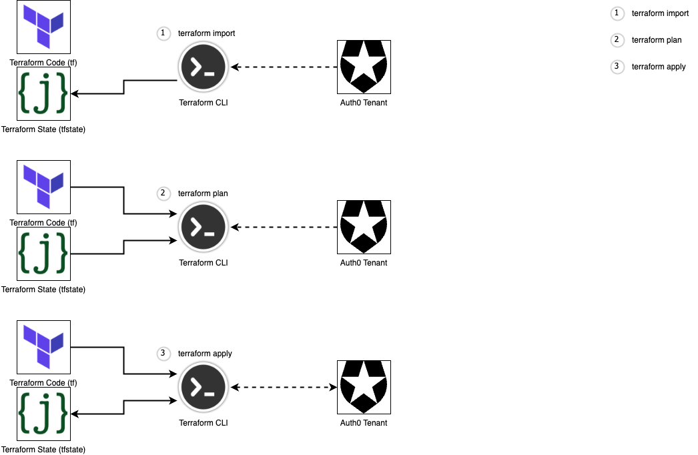

autoscale: true
footer: Zuhlke Engineering Asia
slidenumbers: true

# Mastering _**Auth0**_ with _**Terraform**_

## An **IoC** approach to Auth0 Configuration Management

#### by _**Kevin Lin**__

---

# [fit] **_1. Introduction_**

- Why I want to give this talk?
- What you will get from the talk?

^ 1. This talk is like a utility book, not in depth, but can be easily applied
1. You will learn a new skill that can be applied to your next project
1. A fresh perspective on DevOps in software project
Brief background of the speaker and their experience with Terraform and Auth0
Overview of Auth0 and its capabilities
The importance of managing Auth0 configurations effectively

---

# _**Terraform**_
## [https://www.terraform.io/](https://www.terraform.io/)

- A tool for infrastructure as code (IaC) that define and manage cloud infrastructure in a declarative way
- Users describe the desired state of their infrastructure in code using a high-level language (HCL)
- Helps make infrastructure management more efficient, reliable, and consistent
  - Version-control your infrastructure
  - Collaborate with others
  - Automate your infrastructure management

^ Infrastructure as Code (IaC) is a practice in software engineering that involves managing and provisioning infrastructure using code instead of manual processes
IaC allows for greater consistency, repeatability, and scalability in managing infrastructure, reducing the risk of errors caused by manual configuration.

---

# _**Auth0**_
## [https://auth0.com/](https://auth0.com/)

* Cloud-based identity platform for authentication and authorization services
* Add secure authentication and authorization capabilities to web, mobile, and legacy applications
* Supports a wide range of identity providers, including social media, enterprise, and government identity systems.
* Features include single sign-on, multifactor authentication, and user management.

---

# [fit] _**2. The Problem**_

^ Common problems and struggles with managing Auth0 configurations
Examples of potential security risks and operational issues with manual or ad hoc management approaches
The importance of repeatability and consistency in managing Auth0 configurations

---

# [fit] 😀
# At the beginning, everything is simple and easy ...

 Patient App | Doctor App | Admin App |
:-----------:|:----------:|:---------:|
     SIT     |    SIT     |    SIT
             |            |

---

# [fit] 😅
# Then comes UAT ...

Patient App | Doctor App | Admin App |
:----------:|:----------:|:---------:|
  SIT       |    SIT     |    SIT
  UAT       |    UAT     |    UAT
            |            |

---

# [fit] 😰
# And then we need to set up Production to go live!!

Patient App | Doctor App | Admin App |
:----------:|:----------:|:---------:|
  SIT       |    SIT     |   SIT
  UAT       |    UAT     |   UAT
**PROD**    |  **PROD**  | **PROD**

---

# [fit] 😡
# And now we need to support Staging as well!!!

Patient App | Doctor App | Admin App |
:----------:|:----------:|:---------:|
  SIT       |    SIT     |   SIT
  UAT       |    UAT     |   UAT
  STG       |    STG     |   STG
**PROD**    |  **PROD**  | **PROD**

---

# [fit] _**3. The Solution**_

^ How Terraform can be used to manage Auth0 configurations effectively
Key benefits of using Terraform with Auth0, including improved consistency, security, and scalability
A detailed explanation of how Terraform can be used to manage Auth0 configurations

---

# #1 Connect to Auth0 Management API

1. Create a Machine to Machine (M2M) Application in Auth0 with the right permissions 
1. Setting Auth0 environment variables locally

```shell
export AUTH0_DOMAIN=***********
export AUTH0_CLIENT_ID=***********
export AUTH0_CLIENT_SECRET=***********
```

---

# #2 Configure your Terraform module 

Configure the Provider in `main.tf`

```json
terraform {
  required_providers {
    auth0 = {
      source  = "auth0/auth0"
      version = "~> 0.43.0"
    }
  }
}

provider "auth0" {}
```

---

# #3 Initialise your Terraform module

Run the command from the module folder:

```shell
terraform init
```

And you are ready to go!

---

# Auth0 Resource in Terraform - Client

```json
resource "auth0_client" "admin_app" {
  allowed_clients      = []
  allowed_logout_urls  = [...]
  allowed_origins      = []
  app_type             = "spa"
  callbacks            = [...]
  client_aliases       = []
  client_metadata      = {}
  cross_origin_auth    = false
  custom_login_page_on = true
  grant_types = [
    "authorization_code",
    "refresh_token",
    "password",
    "http://auth0.com/oauth/grant-type/password-realm",
  ]
  is_first_party                      = true
  is_token_endpoint_ip_header_trusted = false
  name                                = "Admin App"
  oidc_conformant                     = true
  sso                                 = false
  sso_disabled                        = false
  token_endpoint_auth_method          = "none"
  web_origins                         = [...]

  jwt_configuration {
    alg                 = "RS256"
    lifetime_in_seconds = 36000
    scopes              = {}
    secret_encoded      = false
  }

  refresh_token {
    ...
  }
}
```

---

# Auth0 Resource in Terraform - SMS Connection

```json
resource "auth0_connection" "sms" {
  is_domain_connection = false
  metadata             = {}
  name                 = "sms"
  strategy             = "sms"

  options {
    allowed_audiences              = []
    api_enable_users               = false
    auth_params                    = {}
    brute_force_protection         = true
    ...
    from                           = "+12184223634"
    import_mode                    = false
    ips                            = []
    name                           = "sms"
    non_persistent_attrs           = []
    pkce_enabled                   = false
    requires_username              = false
    scopes                         = []
    scripts                        = {}
    sign_saml_request              = false
    strategy_version               = 0
    syntax                         = "md_with_macros"
    template                       = <<-EOT
            Your verification code is: @@password@@
        EOT
    twilio_sid                     = "***********"
    twilio_token                   = "***********"
    ...

    totp {
      length    = 6
      time_step = 180
    }
  }
}
```

---

# Auth0 Resource in Terraform - Email Provider

```json
resource "auth0_email" "smtp_email_provider" {
  default_from_address = "support@nextgen.com"
  enabled              = true
  name                 = "smtp"

  credentials {
    smtp_host = "email-smtp.ap-southeast-1.amazonaws.com"
    smtp_port = 587
    smtp_user = "***********"
    smtp_pass = "***********"
  }
}

resource "auth0_connection_client" "sms_conn_patient_app_assoc" {
  depends_on    = [auth0_connection.sms, auth0_client.native_app]
  connection_id = auth0_connection.sms.id
  client_id     = auth0_client.native_app.id
}
```

---

# [fit] _**5. Lessons Learned**_

^ Sharing of real-world examples of Terraform being used to manage Auth0 configurations
Lessons learned from using Terraform to manage Auth0 configurations in production
Best practices for using Terraform with Auth0 and how to get started

---

# Store Terraform state files as code

1. Stores unique IDs for TF to retrieve the latest state from Auth
1. Output any resource object from state in standard format

```shell
terraform import auth0_client.web_client AaiyAPdpYdesoKnqjj8HJqRn4T5titww
terraform state show auth0_client.web_client
```

---

# Import TF state first before any changes



---

# Use Workspace to manage multiple environments

Together with TF variables, you manage multiple environments with the same TF module: 

```shell
terraform workspace list
terraform workspace select sit
terraform workspace new uat

terraform plan -var-file=$(terraform workspace show).tfvars
terraform apply -var-file=$(terraform workspace show).tfvars
```


---

# [fit] _**6. Code Demo**_##

### [https://github.com/kevinlin/auth0-configuration-demo](https://github.com/kevinlin/auth0-configuration-demo)

^ echo "AUTH0_DOMAIN=$AUTH0_DOMAIN"
echo "AUTH0_CLIENT_ID=$AUTH0_CLIENT_ID"
echo "AUTH0_CLIENT_SECRET=$AUTH0_CLIENT_SECRET"

^ export AUTH0_DOMAIN=nextgen-dev.au.auth0.com
export AUTH0_CLIENT_ID=uo4Y4x38QPbLpbSrMEIThAZ5pcWDUNSu
export AUTH0_CLIENT_SECRET=7XYmE3QMblDoaQysMugXpNaAxBVRvTHWLQurzQp4OPcXElcWzFbeVG7JYTYLJE52

^ terraform import -var-file=$(terraform workspace show).tfvars auth0_client.mobile_app p8e0QTi32665C19URneKXhhqdPBStvCh

---

# [fit] _**6. Possibilities**_

---

# [fit] _**Q&A and Sharing**_

^ Open floor for attendees to ask questions about the presentation and topics discussed
Opportunity for attendees to share their experiences with Terraform and Auth0
Summary of the presentation and key takeaways
Invitation to continue the conversation with the speaker after the session
Thank you to the attendees for their time and attention