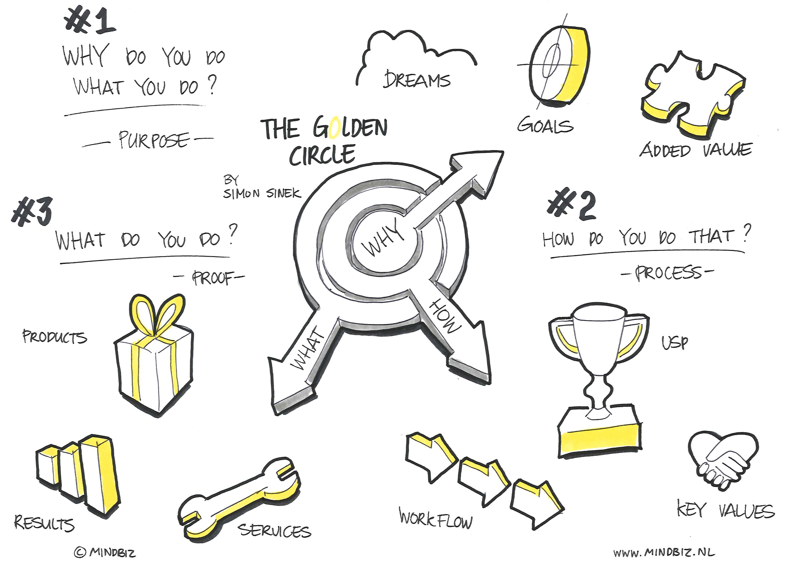
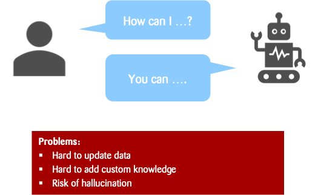
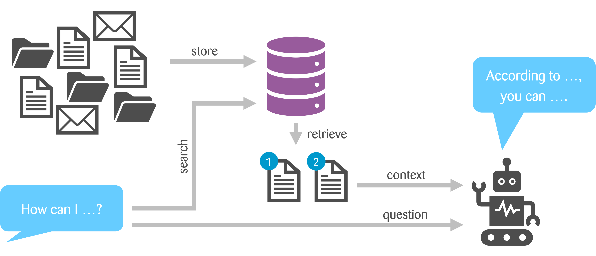
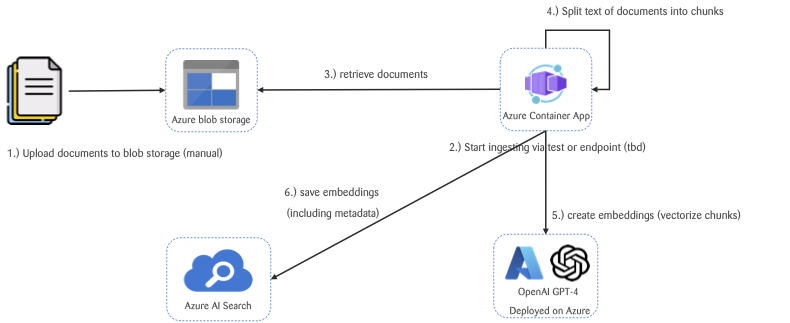

autoscale: true
footer: © Zühlke APAC SWEX+DX 2024
slidenumbers: true

# [fit] RAGify Your Skills

# >

# Hands-on Workshop with

# Python, FastAPI, and Azure Services

---

# [fit] **_1_**

---

# [fit] Introduction to **_RAG_**

## Estimated time: 30 minutes

#### by _**Kevin Lin**_, _**Andreas Mueller**_

---

^ Illustration of Simon Sinek's "Golden Circle”
Start anything we do by first asking the Why questions. Understand the purpose, goal of what we do, before moving on to How and What.
Company perspective: Why is RAG relevant to Zuhlke's AI strategy?  
Individual perspective: Why should I learn and care about RAG as a software engineer?  

---

# Retrieval Augmented Generation (RAG)

An NLP approach that combines the strengths of **_retrieval_** systems and **_generative models_**.

Retrieving relevant information from **external** knowledge sources and using it to generate more **accurate** and **contextually relevant** responses

---

# Using an LLM in a Q&A Setup

---

# Q&A solution using RAG

---

# Strength of RAG

1. **Enhanced Accuracy and Reliability**
   • **Grounded Responses**: RAG models retrieve factual information from trusted sources, grounding their outputs in
   real data and reducing incorrect answers (Lewis et al., 2020).
   • **Reduced Hallucinations**: By accessing external knowledge bases, RAG minimizes the generation of fabricated
   information.

1. **Up-to-Date Information with Improved Contextual**
   • **Dynamic Knowledge Integration**: RAG can incorporate the latest information without retraining the entire model,
   ensuring responses reflect current data (Lewis et al., 2020).
   • **Adaptability**: Models can quickly adapt to new domains by updating the retrieval database.
   • **Contextual Relevance**: Accessing relevant documents during generation leads to more contextually appropriate
   responses.
   • **Disambiguation**: The retrieval process helps resolve ambiguities by considering a wider context.

1. **Efficiency in Knowledge-Intensive Tasks**
   • **_Scalability_**: RAG handles large data volumes efficiently, suitable for applications like customer support with
   vast knowledge bases.
   • **_Domain Specificity_**: Tailoring the retrieval corpus allows for industry-specific applications.

---

# Challenges with RAG

1. **Quality and Bias of Retrieved Data**
   • **Dependence on Data Sources**: Accuracy relies on the quality of external knowledge bases (Lewis et al., 2020).
   • **Bias Amplification**: Potential propagation of biases from the retrieval corpus.

1. **Integration and Maintenance**
   • **System Complexity**: Integrating retrieval systems adds architectural complexity.
   • **Continuous Updating**: Ongoing maintenance is required to keep knowledge bases current.

1. **Privacy and Security Concerns**
   • **Data Leakage**: Accessing external data raises concerns about exposing sensitive information.
   • **Compliance Risks**: Ensuring adherence to data protection regulations like GDPR.

---

# Workshop Goal

> To implement a reference RAG application that retrieves and generates based on documents stored in Azure DevOps.

Full details available on the Wiki: [Workshop Documentation](https://dev.azure.com/zuhlke-apac/RAG%20Workshop/_wiki/wikis/RAG-Workshop.wiki/1/Home)

---

# Use Case

Test our RAG application with Zühlke insurance documents to evaluate its effectiveness.  

1. Is teeth cleaning covered?
1. Are shampoos or moisturizers for eczema covered under the policy?
1. Are drugs purchased without a doctor’s prescription covered under the policy?
1. Is a referral letter required before seeing a specialist?
1. What should I do if I need an MRI after visiting A&E?
1. What ward am I covered for hospitalisation?
1. What is the coverage limit for specialist consultations?

---

# Key **Infra Service** Required

Azure Cloud supports developing RAG by providing tools for managing LLMs, databases, and integrating them through APIs:

- Azure AI Search - Vector Database for retrieval
- OpenAI models - LLM for embeddings and generation
- Azure Blob Storage - Document storage

^ We are taking a very opinionated approach here.
The workshop's purpose is not to teach you how to set up Azure services, but to provide a working environment for the workshop.

---

# [fit] >

# [fit] Live Demo with Front-end

# [fit] >

^ Andy to demo the end-to-end solution

---

# How do we start?

High-Level tasks for everyone:

1. **Setup Environment**: Setup environment and dependencies for the backend application
2. **Document Ingestion**: Load, chunk, and embed documents for the Vector DB
3. **Query and Retrieval**: Implement retrieval logic to query the Vector DB using embeddings
4. **Frontend Integration**: Run the frontend and integrate it with the backend to test the application

---

# How do we start?

1. Find your partner or team, and work together (Pair or Trio)
1. Use the **Parking Lot** for questions that arise or reach out to us
1. Follow the agenda

---

# Agenda

1. Day 1 (Thu)
    1. Introduction to RAG - 30 mins
    1. Setup Environment (hands-on) - 60 mins
        * Break - 30 mins
    1. Ingestion (hands-on) - 60~90 mins
1. Day 2 (Fri)
    1. Retrieval (hands-on) - 60 mins
    1. Put It All Together (hands-on) - 60 mins
        * Break - 30 mins
    1. Forward and Beyond - 30 mins

---

> The best way to learn something is to do it.
-- Aristotle