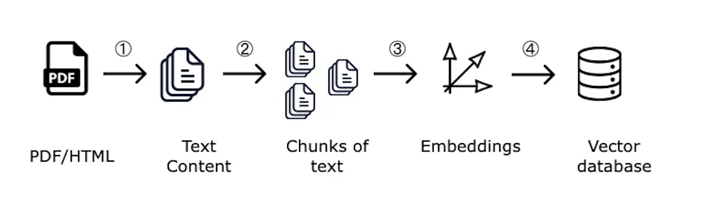
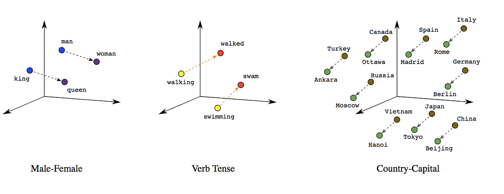

autoscale: true
footer: © Zühlke APAC SWEX+DX 2024
slidenumbers: true

# [fit] **_3_**


---

# RAG Workshop - Ingestion

### Ingestion process involves chunking the documents, convert to embeddings and store it in a vectorDB

## Estimated time: 60 minutes

### by _**Kevin Lin**_, _**Andreas Mueller**_


---

# Steps to Ingest Documents

Prep.: **Create Index** in AI Search (Vector DB)

1. **Load documents** from local storage or Azure Blob Storage
1. **Chunk document(s)** into manageable parts based on tokens.
1. **Create embeddings** for the document chunks.
1. **Upload** the embeddings to AI Search (Vector DB)



---

# Why do we need chunking?

- **Chunking** is the process of breaking documents into smaller, meaningful parts.
- These parts are small enough for **efficient embedding** and retrieval.
- Chunking ensures that our model can access **relevant context** without being overwhelmed by too much data.

---

# What are Embeddings?

> An **embedding** is a **vector** (list) of floating point numbers.
> The **distance** between two vectors measures their **relatedness**. Small distances suggest high relatedness and
> large distances suggest low relatedness.
> -- OpenAI


^ Generated using pre-trained models, embeddings are key for searching documents in RAG systems.

---

# Vector relatedness



^ They capture the **meaning** of the text so that similar pieces of information are close in the vector space.

---

# What Is a Vector Database?

- A **Vector Database** stores embeddings for efficient search.
- It helps quickly find **relevant document chunks** based on their semantic meaning.
- Common options include **Pinecone**, **Weaviate**, and **Azure AI Search**.


---

# Ingestion: Hands-On tasks

---

# Step 1: Create Vector DB Index

# Task

- Set up a new **index** in the **shared** AI Search to store document chunks with embeddings

# Expected Outcome

- Go to AI Search
  instance: [srch-swex-rag-workshop - Indexes](https://portal.azure.com/#@Zuhlke.onmicrosoft.com/resource/subscriptions/2c4316ad-6733-400d-b11f-60373577116c/resourceGroups/rg-swex-rag-workshop/providers/Microsoft.Search/searchServices/srch-swex-rag-workshop/indexes)
  and verify your index is created
- Click on your index, select _field_ and verify the field configuration (_embedding_ field needs to be retrievable)

---

# Sample Code #1

```python
# Create the index
fields = [
    SimpleField(name="id", type=SearchFieldDataType.String, key=True),
    SearchableField(name="filename", type=SearchFieldDataType.String, filterable=True, sortable=True),
    SearchableField(name="content", type=SearchFieldDataType.String),
    SearchField(
        name="embedding",
        type=SearchFieldDataType.Collection(SearchFieldDataType.Single),
        hidden=False,
        searchable=True,
        vector_search_dimensions=1536,
        vector_search_profile_name="default"  # use default `myHnswProfile`
    ),
]

vector_search = VectorSearch(
    profiles=[VectorSearchProfile(name="default", algorithm_configuration_name="default")],
    algorithms=[HnswAlgorithmConfiguration(name="default")]
)

index = SearchIndex(
    name=AI_SEARCH_INDEX_NAME,
    fields=fields,
    vector_search=vector_search
)

# Create the index
search_index = await ai_search_index_client.create_index(index)
```

---

# Step 1: Create Vector DB Index - Hints

- Use the index POST endpoint to trigger index creation
- Use components from the **Azure Search Documents** library
- Adapt _AI\_SEARCH\_INDEX\_NAME_ in the .env file to your name, use the pattern: _[firstname]\_[lastname]\_rag\_workshop_
- Make sure your index contains at least separate fields for _id_, _filename_, _content_ and _embeddings_

## Sample document representation

```json
{
  "id": "0d1f45b1-c19a-4254-9390-5bd8a3b94c95",
  "filename": "document.pdf",
  "content": "This is the content of the document",
  "embedding": [
    0.00838001,
    ...
  ]
}
```

---

# Step 2: Loading Documents

# Task

- Use the insurance documents
  from [Wiki - Workshop Document - Input Document](https://dev.azure.com/ZuhlkeAsia/RAG%20Workshop/_wiki/wikis/RAG-Workshop.wiki/134/Input-Document)
  as input document
- Load the documents from **local filepath**.

# Expected Outcome

- The full text content of the PDF file is extracted as string for further processing

---

# Step 2: Loading Documents - Hints

- Use the **[pypdf](https://pypi.org/project/pypdf/)** library to extract the text content
- Consider write a test to verify the content of the document is correctly loaded

## Helper Prompt

```text
Implement a Python function that Loads a local document to extract the text content. 
Use the library: pypdf~=5.0.0 for PDF file.
```

---

# Step 3: Chunking Documents

# Task

- Split documents into smaller **chunks** based on token limits
- Create token-based chunks to ensure manageable sizes for embedding and retrieval

# Expected Outcome

- A list of chunks represented as list of strings

---

# Step 3: Chunking Documents - Hints

- There are many different chunking algorithms out there. Focus on a simple, token based one.
- You can either write your own or use the provided **[nltk](https://www.nltk.org/)**
- Don't waste too much time on finding the right one, you can fine tune it later

## Helper Prompt

```text
Implement a Python function to chunk the document content into parts based on tokens (e.g., 500 tokens per 
chunk). Ensure each chunk is self-contained without breaking sentences.
Use the library: nltk~=3.9.1
```

---

# Step 4: Create Embedding(s)

# Task

- Use a deployed OpenAI model to create embeddings for individual or list of chunks

# Expected Outcome

- An embedding representation (list of floats) for each chunk

---

# Step 4: Create Embedding(s) - Hints

- Use a **embedding client** of Azure Open AI to generate the embedding
- There are two different LLM models available in the env. config. Make sure to use the embedding model for this step.

^ **text-embedding-3-small**

## Helper Prompt

```text
Implement a Python function to generate embeddings for individual or multiple chunks using an Azure OpenAI 
model.
Use the library: openai~=1.46.1 or azure-ai-inference==1.0.0b5 
```

---

# Step 5: Upload documents to Vector DB

# Task

- Combine chunk contents with their embeddings into document representations
- Upload these documents into your Azure AI Search DB (Vector DB)

# Expected Outcome

- Your vector DB index filled with your chunked document
- Go
  to [srch-swex-rag-workshop - Indexes](https://portal.azure.com/#@Zuhlke.onmicrosoft.com/resource/subscriptions/2c4316ad-6733-400d-b11f-60373577116c/resourceGroups/rg-swex-rag-workshop/providers/Microsoft.Search/searchServices/srch-swex-rag-workshop/indexes)
  and search your index
- Click on your index, click on _Search_ on the _Search explorer_ view
- Verify that the index contains a list of documents

---

# Step 5: Upload documents to Vector DB - Hints

- Use the **[Azure Search Documents](https://pypi.org/project/azure-search-documents/)** client to upload your documents
- Remember the index you created earlier? The document structure needs to match the index fields exactly!

## Helper Prompt

```text
Help me to write a Python function that upload object which that contains contain text chunk and embedding to an 
index Azure AI Search. 
Use the library: azure-search-documents~=11.5.1
```
