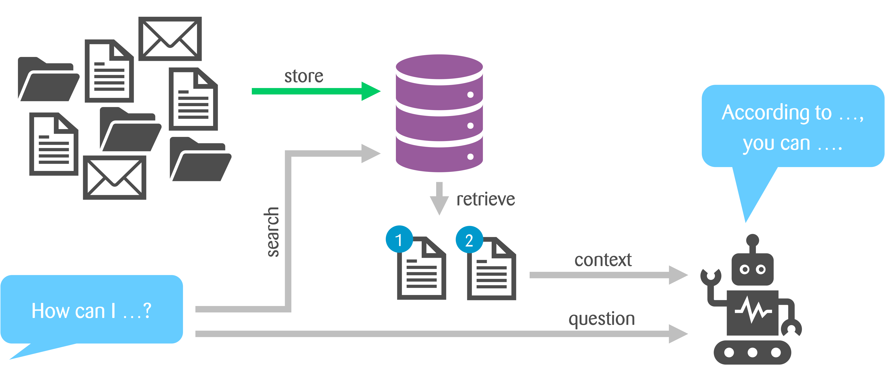

autoscale: true
footer: © Zühlke APAC SWEX+DX 2024
slidenumbers: true

# [fit] **_4_**


---

# RAG Workshop - Retrieval

### The retrieval process allows us to find relevant document chunks based on a user's question.

## Estimated time: 60 minutes

### by _**Kevin Lin**_, _**Andreas Mueller**_


---

# Before we start

## For those who want a working version of ingestion to begin with

1. Check out the **`ingestion`** branch of the template repo
1. Mark the `backend` folder as a source root in PyCharm
    1. Go to Settings
    2. Under Project Structure, ensure that the `backend` is listed as a Source folder
1. Install the necessary Python packages and initialise nltk

```shell
git clone -b ingestion https://xxx@dev.azure.com/ZuhlkeAsia/RAG%20Workshop/_git/rag-template
pip install -r requirements.txt
pip install -r requirements-dev.txt
python -m nltk.downloader popular
# In case you encounter SSO issue when initiaising NLTK
export SSL_CERT_FILE=$(python -m certifi)
sudo sh "Install Certificates.command"
```

---

# Let's Recap What We've Implemented



---

# Steps to Retrieve Information and Use it for Answer Generation

1. Create **embedding** of the **user question**
2. **Query the Vector DB** using the embedding to retrieve relevant document chunks
3. Create a **prompt** using the user question and the retrieved chunks plus a system message
4. Use the prompt to get an **answer** from the LLM.

---

# [fit] Infra Service Walkthrough
# Azure OpenAI Serivce and Model Deployment


---

# Step 1: Receive Input and Create Embedding

## Task

- Create **embedding** from the input question using the same embedding model used during the ingestion process
- This embedding helps represent the question in the **vector space**.

## Expected Outcome

- A **vector** representing the input question.

---

# Step 1: Receive Input and Create Embedding - Hints

- Use an **embedding client** of Azure Open AI to generate the embedding
- There are two different LLM models available in the env. config. Make sure to use the embedding model for this step.

^ **text-embedding-3-small**

## Helper Prompt

```text
Implement a Python function to generate embedding for input text by invoking an Azure OpenAI service using embedding 
client. 
Use the library: openai~=1.46.1 or azure-ai-inference==1.0.0b5 
```

---

# Step 2: Query the Vector DB

## Task

- Query the Vector DB with the question text and its **embedding** to retrieve the most relevant document chunks.

## Expected Output

- A list of top 3 **retrieved documents** relevant to the embedding (of the user question)

---

# Step 2: Query the Vector DB - Hints

- Perform a **hybrid search** (use default profile) that combines semantic vector search and traditional keyword search.
- This approach helps us retrieve the most relevant document chunks.

## Helper Prompt

```text
Help me to write a Python function that queries the Azure AI Search with question embedding to retrieve the top 3 most 
relevant document chunks.
Use library: azure-search-documents~=11.5.1
```

---

# Hybrid Search Explained

- **Semantic Search**: Finds chunks that are similar in meaning.
- **Keyword Search**: Searches for exact keyword matches.
- Combining these approaches improves the quality of the retrieved context.

---

# Step 3: Create a Prompt with Retrieved Chunks

## Task

- Combine the **user question** with the **retrieved chunks** to create a detailed prompt.
- The goal is to provide the LLM with enough **context** to generate an accurate answer.

## Expected Outcome

- A **complete prompt** that is ready to be passed to the LLM. The prompt should include a system message, user question and the retrieved chunks.

---

# Step 3: Create Prompt with Retrieved Chunks - Hints

- Keep a history of questions from users to provide **context**, starts with in-memory array

## Helper Prompt

```text
Refactor my Python app code to maintain a history of user questions.
Write a new function that creates a detailed prompt by combining the user question with the 
retrieved document chunks. 
```

---

# System Message in Prompt

- The **system message** defines the behavior of the AI assistant during retrieval.
- It sets the context for the AI, such as:
    - The assistant’s role (e.g., an expert in insurance policies).
    - Rules for response generation (e.g., use only the provided sources).
- This helps ensure **consistency** and **accuracy** throughout user interactions.

---

# Sample System Message in Prompt

```python
system_prompt = {
    "role": "system",
    "content": "You are an AI Assistant helping to compare different health insurance policies. "
               "Be brief in your answers. "
               "Answer ONLY with the facts listed in the list of sources below. "
               "If there isn't enough information below, say you don't know. "
               "Do not generate answers that don't use the sources below. "
               "Each source has a name followed by colon and the actual information, include the source name for each fact you use. "
               "Use square brackets to reference the source, for example [info1.txt]."
}
```

---

# Step 4: Get Answer from LLM

## Task

- Pass the complete prompt to the **LLM**.
- The LLM will use the context to generate a **grounded response**, reducing hallucinations.

## Expected Outcome

- A valid response generated by the LLM based on the user question and retrieved chunks.

---

# Step 4: Get Answer from LLM - Hints

- Use a **chat completion client** of Azure Open AI to retrieve the response
- There are two different LLM models available in the env. config. Make sure to use the chat model for this step.

^ **gpt-4o-mini**

## Helper Prompt

```text
Implement a Python function that takes the complete prompt and invoke Azure OpenAI Model using text completion client. 
Ensure 
Use the library: openai~=1.46.1 or azure-ai-inference==1.0.0b5 
```
