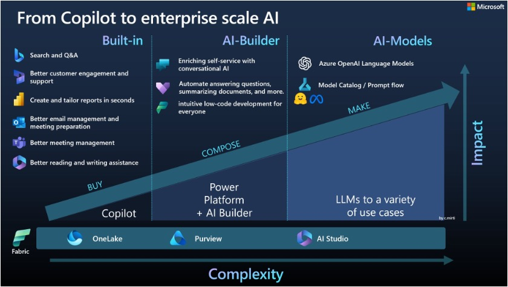
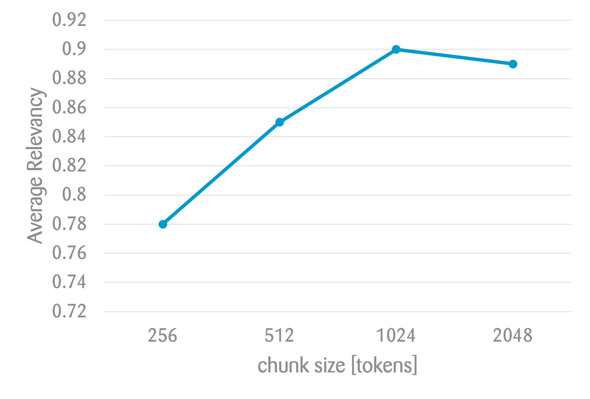
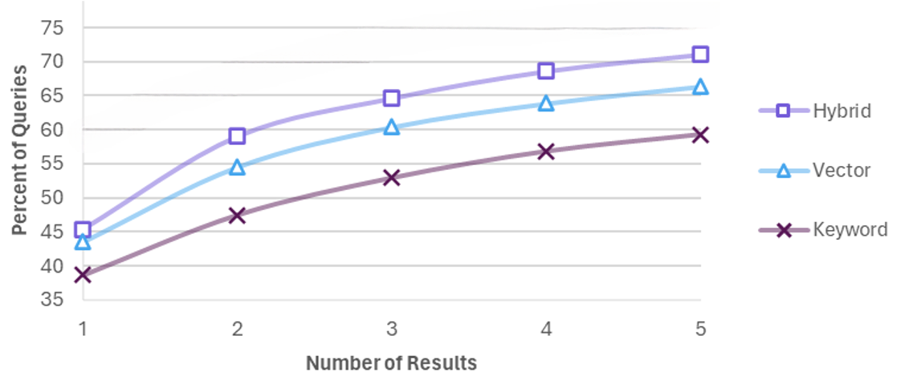
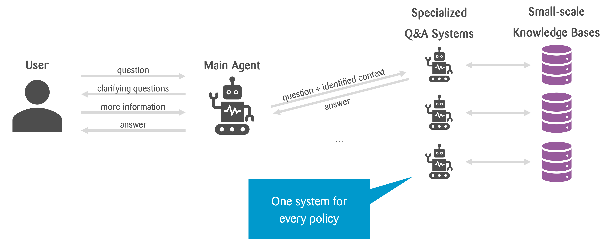

autoscale: true
footer: © Zühlke APAC SWEX+DX 2024
slidenumbers: true

# [fit] **_6_**

---

# RAG Workshop - Forward and Beyond

## Estimated time: 30 minutes

### by _**Kevin Lin**_, _**Andreas Mueller**_

---

# Current State: Proof of Concept (POC)

- What we've built so far is a **POC**, not ready for commercial use.
- Many tech companies have built production-ready RAG solutions.
    - Example: [Azure Search + OpenAI Demo](https://github.com/Azure-Samples/azure-search-openai-demo).
    - Try out the chat: [https://app-backend-jqtzxisotxoce.azurewebsites.net/#/](https://app-backend-jqtzxisotxoce.azurewebsites.net/#/)

---

# Product vs. Custom Solution

| Use a product if...                    | Build a custom solution if...                      |
|----------------------------------------|----------------------------------------------------|
| ... data is already at the right place | ... need to integrate data sources                 |
| ... it works well for your use case    | ... out-of-the-box products don’t work well enough |
| ... the licensing costs are acceptable | ... development- and operation-costs are cheaper   |

---

# The Path Forward

- Turning the POC into a **scalable product**.
- Exploring **multi-agent architectures** and **advanced chunking** for better retrieval and response.
- Leveraging the **feedback loop** to continuously improve the model
- Enhance feature set according to use case

---

# Zühlke has its own **Sales Accelerator**

- Built based on **UNIQA** source code, with fully customizable UI.
- Able to spin up a new instance in hours

---

# 💡 Topic: Evaluation

## Measure Response Quality

- Add an **evaluation framework** to assess the quality of responses.
- Key metrics for evaluation:
    - **Retrieval accuracy**
    - **Response quality**
    - **User satisfaction**

---

# 💡 Topic: Evaluation

## Automated LLM responses validation is difficult

Each answer is different, standard assertions are tricky.
Extracting meaning with help of LLMs not good enough (yet)

- Approaches to consider:
  - Evaluate **chunk retrieval accuracy** (no LLM validation needed)
  - Lab testing setup - generate report for **manual validation**
  - **RAGAS**: Retrieval-Augmented Generation Assessment System.

---

# 💡 Topic: Improve Chunking

## Clean up your documents

**Preprocess** documents by removing non-content information (headers, footers, tables).
- **Remove Header & Footer**, irrelevant
- **Remove table of contents**, creates confusing chunks
- **Remove or convert tables**, LLMs can't understand table content by default
- **Remove images**, LLMs can't process content hidden in images

Structured formats work best!

---

# Chunking heavily impacts retrieval performance

* **Find best chunk size:**
  * Chunks too small: miss context
  * Chunks too large: embeddings too generic
  * Hyperparameter (same as overlap)
* **Smart splitting of chunks:**
  * Adaptive chunk size based on content (e.g. embedding distance)
  * Use document structure (sections / paragraphs / …)
* **Add more context to chunks:**
  * File-name, title of document, name of (sub-)chapter
    * Can even ask LLM to output exact reference to answer then
  * Text before & after (but not part of embedding)

> https://www.llamaindex.ai/blog/evaluating-the-ideal-chunk-size-for-a-rag-system-using-llamaindex-6207e5d3fec5

---

# 💡 Topic: Improve Chunking

## Improve response quality by improve chunking

- Experiment with different **chunk sizes**.
- Use different **chunking algorithms** (e.g., character-based, overlapping).
- **Context-based chunking** (manual adjustments based on document structure).

^ Refer to the **wiki page** for task description and links to different chunking algorithms to explore.

---

# 💡 Topic: Improve Searching
## Combine keyword- and vector-search

- Perform a **hybrid search** that combines semantic vector search and traditional keyword search.
- Whereas embeddings usually outperform keywords, their combination can be even more powerful

> Azure Cognitive Search: Outperforming vector search with hybrid retrieval and ranking capabilities

---

# 💡 Topic: Improve Searching - Continued

* **Query transformation**
  * Reformulate question / create multiple questions out of it, search with all of them
* **Use meta-data of files**
  * E.g. consider date of document in re-ranking
* **Hierarchical search**
  * First search in document summaries, then within relevant documents only
* **Semantic Reranking**
  * Rerank results based on the context, to promote results that fit query intent 

---

# 💡 Topic: Multi-Agent Approach

## Problem: 
Your RAG application has policies for different regions stored. The policies have a high overlap on the vector map, as they cover similar topics. The vector search struggles to retrieve the correct chunks based on the region requested.

## Solution: Use Multi-Agent Setup

- Implement a **multi-agent approach** to manage regional context.
- Introduce a **main agent** that determines the requested region.
- Use **function-responses** to redirect questions to the appropriate regional agents.

^ This approach allows more precise retrieval of documents based on regional context.

---

# Incorporate agent in the retrieval process
## Approach also known as “query routing”

---

# That's just the beginning
# There is much more to explore

- Conversation awareness
- Prompt engineering
- Iterative Search
- Hypothetical questions
- Performance/cost optimizations
- ...

---

# Questions?

---

# What's next?

- If you are interested: Improve your solution further! 
  - Pick and choose from the topics
  - Good start could be [Bonus Task: Evaluation](https://dev.azure.com/ZuhlkeAsia/RAG%20Workshop/_wiki/wikis/RAG-Workshop.wiki/145/Topic-Evaluation) or [Bonus Task: Chunking](https://dev.azure.com/ZuhlkeAsia/RAG%20Workshop/_wiki/wikis/RAG-Workshop.wiki/144/Topic-Improve-Chunking)
- Reach out to us if you'd like to access the resources beyond the camp.
