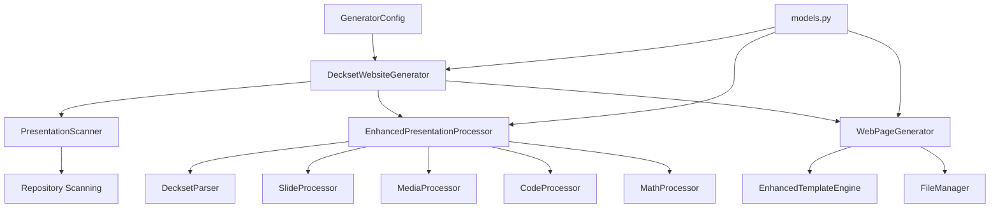
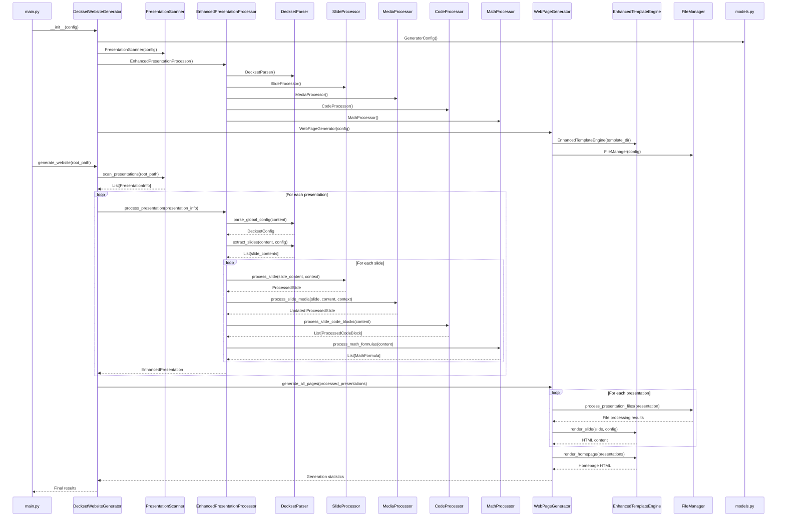

# Enhanced Design Document

## Overview

This enhanced design implements a comprehensive Deckset-compatible markdown processor with all enhanced features enabled by default. The system parses and renders all Deckset markdown features while maintaining the existing multi-presentation website structure. The architecture emphasizes modularity, extensibility, and faithful reproduction of Deckset's markdown semantics in a responsive web environment.

## Architecture

### High-Level Architecture

### Component Interaction Diagram

The following diagram shows the detailed interaction between all components starting from `DecksetWebsiteGenerator` in `main.py`:

## Data Models

All data models are defined in `models.py` with comprehensive type definitions:

### Core Models
- **PresentationInfo**: Metadata about discovered presentations
- **ProcessedPresentation**: Fully processed presentation with slides
- **Slide**: Individual slide with content and metadata
- **GeneratorConfig**: Global generator configuration

### Enhanced Models  
- **EnhancedPresentation**: Comprehensive presentation with Deckset features
- **ProcessedSlide**: Enhanced slide with media, code, math, and layout features
- **DecksetConfig**: Global Deckset configuration settings
- **SlideConfig**: Slide-specific configuration overrides

### Media Models
- **ProcessedImage**: Images with placement and scaling modifiers
- **ProcessedVideo**: Videos with autoplay and control options
- **ProcessedAudio**: Audio files with playback controls
- **MediaModifiers**: Placement and playback configuration

### Content Models
- **ColumnContent**: Multi-column layout content
- **ProcessedCodeBlock**: Syntax-highlighted code with line emphasis
- **MathFormula**: LaTeX mathematical expressions
- **ImageGrid**: Grid layouts for multiple images
## Core Components

### 1. Main Orchestrator (`main.py`)

**DecksetWebsiteGenerator Class**: The main orchestrator that coordinates the entire website generation process.

**Key Methods**:
- `__init__(config)`: Initializes all components (Scanner, EnhancedProcessor, WebPageGenerator)
- `generate_website(root_path, output_dir)`: Main entry point orchestrating the full pipeline
- `generate_single_presentation(folder_path, output_dir)`: Generates a single presentation
- `_scan_presentations()`: Discovers presentations using the scanner
- `_process_presentations()`: Processes each presentation with error handling
- `_generate_website_pages()`: Generates HTML pages and handles file operations

### 2. Repository Scanner (`scanner.py`)

**PresentationScanner Class**: Discovers presentation folders and identifies markdown files.

**Key Methods**:
- `scan_presentations(root_path)`: Scans for presentation folders
- `is_presentation_folder(folder_path)`: Validates if a folder contains presentations
- `_create_presentation_info(folder)`: Creates PresentationInfo objects
- `_has_multiple_independent_presentations()`: Detects multi-presentation folders

### 3. Enhanced Presentation Processor (`enhanced_processor.py`)

**EnhancedPresentationProcessor Class**: Orchestrates comprehensive Deckset markdown processing.

**Component Integration**:
- **DecksetParser**: Parses Deckset-specific syntax and global commands
- **SlideProcessor**: Handles slide content and layout processing
- **MediaProcessor**: Processes images, videos, and audio with modifiers
- **CodeProcessor**: Handles syntax highlighting and line emphasis
- **MathProcessor**: Processes LaTeX math expressions

**Key Methods**:
- `process_presentation(presentation_info)`: Main processing pipeline
- `_parse_global_config(content)`: Extracts global Deckset configuration
- `_extract_slides(content, config)`: Splits content into individual slides
- `_process_slides(slide_contents, config, presentation_info)`: Processes each slide with all features

### 4. Specialized Processors

#### Deckset Parser (`deckset_parser.py`)
- Parses global commands like `slidenumbers: true`, `footer: text`
- Handles slide-specific commands like `[.background-image: file.jpg]`
- Processes `[fit]` headers for auto-scaling
- Extracts speaker notes and footnotes
- Implements emoji shortcode processing
- Converts markdown lists (unordered and ordered) to HTML with proper formatting
- Supports nested lists by indentation (four spaces or a tab) with mixed ordered/unordered combinations
- Converts Markdown links `[text](url)` to safe HTML anchors with URL sanitization and appropriate attributes
- Preserves safe inline HTML (e.g., ` `, ``) after sanitization

#### Slide Processor (`slide_processor.py`)
- Processes individual slide content and layout
- Handles multi-column layouts with `[.column]` syntax
- Applies autoscaling and layout transformations
- Manages slide-specific configurations

#### Media Processor (`media_processor.py`)
- Processes images with placement modifiers (`![left]`, `![fit]`, `![background]`)
- Handles video processing with autoplay, loop, and mute options
- Manages audio files with playback controls
- Creates image grids for multiple consecutive images
- Handles image file paths with spaces/Unicode; parses adjacent inline images on the same line without requiring whitespace separators
- Supports animated GIF rendering without conversion to static frames

#### Code Processor (`code_processor.py`)
- Provides syntax highlighting for code blocks
- Handles line emphasis and highlighting directives
- Supports multiple programming languages
- Integrates with Prism.js for web rendering
- Detects and renders indented code blocks (four spaces or a tab) equivalently to fenced code

#### Math Processor (`math_processor.py`)
- Processes LaTeX math expressions (both inline and display)
- Validates LaTeX syntax
- Integrates with MathJax for web rendering
- Handles both `$...$` and `$$...$$` syntax
- Renders math inside footnotes and table cells with the same rules and responsive overflow behavior

### 5. Web Page Generator (`generator.py`)

**WebPageGenerator Class**: Creates HTML pages and manages output generation.

**Key Methods**:
- `generate_all_pages(processed_presentations)`: Generates all presentation pages and homepage
- `generate_presentation_page(presentation, output_path)`: Creates individual presentation HTML
- `generate_homepage(presentations, output_path)`: Creates the main index page
- `_render_enhanced_presentation(presentation)`: Renders presentations with full Deckset features
  - Builds an internal anchor index across slides; de-duplicates conflicting IDs and rewrites internal fragment links accordingly

### 6. Enhanced Template Engine (`enhanced_templates.py`)

**EnhancedTemplateEngine Class**: Advanced HTML template rendering with full Deckset feature support.

**Template Files**:
- `templates/slide.html`: Main slide template with all Deckset features
- `templates/homepage.html`: Homepage template for presentation listings
- `templates/slide_styles.css`: Deckset-compatible styling
- `templates/assets/js/slide-viewer.js`: Interactive slide navigation

**Key Rendering Methods**:
- `render_slide(slide, config)`: Renders individual slides with all features
- `render_homepage(presentations)`: Renders the main homepage
- `render_columns(columns)`: Handles multi-column layouts
- `render_background_image(image)`: Processes background images
- `render_video_player(video)`: Creates video players with controls
- `render_code_block(code_block)`: Renders syntax-highlighted code
- `render_math_formula(formula)`: Renders mathematical expressions
- `_markdown_to_html(content)`: Converts markdown to HTML with comprehensive inline formatting (links, emphasis, lists)
- `sanitize_and_render_link(text, url, title)`: Sanitizes URLs and renders anchors with `target`/`rel` for external links
  - Resolves internal anchors and attaches `id` attributes to headings and named anchors

### 7. File Manager (`file_manager.py`)

**FileManager Class**: Handles file operations and asset management.

**Key Methods**:
- `process_presentation_files(presentation)`: Copies and optimizes presentation assets
- `copy_media_files(src_dir, dest_dir)`: Handles media file copying
- `optimize_images()`: Optimizes images for web delivery
- `ensure_output_directory(path)`: Creates necessary output directories

## Aspect Ratio Enforcement (16:9)

All slides are rendered into a fixed-ratio container that preserves a strict 16:9 aspect ratio across devices and outputs.

### Technical Approach

- CSS: The slide root uses `aspect-ratio: 16 / 9` for modern browsers. A padding-top fallback (56.25%) ensures compatibility where needed. The inner content uses absolute positioning to fill the 16:9 box.
- Viewport Scaling: The `EnhancedSlideViewer` computes an appropriate `transform: scale(...)` (or CSS `zoom` fallback) so the 16:9 slide fits within the viewport while preserving the ratio. Resize events reflow the scale without content cropping.
- Letterboxing/Pillarboxing: Neutral background bands appear as needed when the viewport ratio differs from 16:9. Content remains centered within the safe area.
- Safe Area: A CSS variable defines a safe content area; autoscale and `[fit]` text sizing operate within these bounds to avoid clipping.
- Print/PDF: Print styles set page boxes to 16:9, ensuring each slide prints as a full page without distortion and with consistent margins.
- Media Within 16:9: Background images/videos use `object-fit: cover|contain` per modifier semantics while honoring the container’s ratio. Left/right and inline media layouts compute within the 16:9 bounds.
  - Adjacent inline images form rows and grids inside the safe area; image gutters adapt responsively

### Link Rendering and Security

- Markdown links are converted to `<a>` tags during `_markdown_to_html` with a whitelist sanitizer (allow: `http`, `https`, `mailto`, `tel`, and `#`).
- External links (`http`, `https`) get `target="_blank"` and `rel="noopener noreferrer"`.
- Internal anchors and relative paths open in the same tab and omit `rel` attributes.
- Optional Markdown titles map to the `title` attribute on anchors.
  
### Internal Anchors and Cross-Slide Navigation

- Headings produce slugified IDs (stable across runs). Conflicts are resolved by suffixing `-n`.
- An index of `id` -> (slide, element) is created during generation to support cross-slide `#fragment` navigation.
- The slide viewer intercepts internal anchor clicks, computes the target slide, navigates to it, and scrolls/focuses the element.
- Unresolvable anchors are left inert and a warning is logged during generation.

## Automatic Readability Filter for Text Over Background Images

Deckset applies a subtle filter when text and a full-slide image are used together so the text remains readable (see example slide 12 in `Examples/10 Deckset basics.md`). The generator reproduces this behavior by default and provides explicit overrides.

### Goals

- Maintain at least WCAG AA contrast for text placed over background images without requiring authors to tune images manually
- Provide deterministic behavior in static HTML/CSS with progressive enhancement via JavaScript for adaptive strength
- Preserve author control through modifiers (`filtered`/`original`) and a `readability-filter` setting at global and slide scopes

### Detection Logic

1. A slide is eligible when both conditions hold:
   - The slide has a background image (implicit `` or `[.background-image: x.jpg]`).
   - The slide also contains visible text content (headings, paragraphs, lists, blockquotes) that overlays the background layer.
2. Exclusions:
   - Inline/left/right images that do not sit behind the text are ignored.
   - If the author forces `![original]` or sets `readability-filter: off`, skip the filter.
   - If the author forces `![filtered]` or sets `readability-filter: on`, always apply the filter at default strength.

### Rendering Approach

- CSS-only baseline:
  - The slide root receives a class `has-readability-filter` when eligible in `auto` mode.
  - A pseudo-element overlay (`::before`) is inserted above the background image layer (z-index: background+1, below content). It uses a semi‑transparent black layer with optional radial/linear gradient to improve contrast across the slide.
  - Optional small Gaussian blur is applied to the background layer via `filter: blur(var(--bg-blur, 2px))` guarded by `backdrop-filter`/`filter` support checks.
- Adaptive JS enhancement:
  - The `EnhancedSlideViewer` samples pixels from the region behind each text block using an offscreen `<canvas>` read of the background image and computes relative luminance/contrast vs. computed text color.
  - If measured contrast < thresholds (3:1 large text, 4.5:1 body), it increases `--overlay-opacity` and optionally `--bg-blur` up to configured maxima; otherwise it decreases toward the baseline.
  - If maximum filter strength still cannot meet contrast, the viewer adds a `text-backplate` class to headings/paragraphs which renders a small border‑radius backplate with the minimal opacity to satisfy contrast.

### Data Model and Configuration

- `SlideConfig.readability_filter_mode: Literal["auto", "on", "off"]` (default: `auto`). Slide-level overrides global setting.
- `ProcessedImage.is_background: bool` (existing) and `ProcessedImage.filter_preference: Optional[Literal["original", "filtered"]]` derived from image modifiers.
- Generator sets slide-level CSS variables:
  - `--overlay-opacity` (default 0.35), `--overlay-gradient` (themeable), `--bg-blur` (default 1–2px), and `--filter-strength-max` (caps adaptation).

### Accessibility and Performance

- Contrast targets follow WCAG AA. The JS adaptation only runs after the background image has loaded and debounces on resize.
- Sampling uses low-resolution canvas reads (e.g., 64×36 grid), minimizing cost. If `canvas` or cross‑origin image reads fail, the system sticks with the CSS baseline.
- All behavior degrades gracefully without JS: baseline overlay remains, ensuring reasonable readability.

### Layering and Z-Index

- Background image: z-index 1
- Readability overlay (`::before`): z-index 2
- Slide content: z-index 3
- UI elements (nav, slide number, footer): z-index 4

### Author Overrides Summary

- Per image: `` forces overlay; `` disables it.
- Per slide/global: `readability-filter: on | off | auto` with slide precedence.

### Testing Strategy

- Static render tests verify that eligible slides receive `has-readability-filter` and the overlay pseudo-element is present.
- JS unit tests simulate low/high-contrast backgrounds and assert variable adjustments and backplate fallback.
- Accessibility tests compute contrast via the same luminance model to verify thresholds.

## Inline Images, Captions, and Modifier Composition

### Inline-in-text sizing

- Parsing: `` within a paragraph is emitted as an inline HTML element (`` or container) with a class `inline-image`.
- Sizing: CSS constrains height to the current line box using `max-height: 1em` (plus minor tuning to match font metrics), preserving aspect ratio; vertical alignment uses `vertical-align: text-bottom` to sit nicely on the baseline.
- Alt text and ARIA: The markdown alt text maps to `alt`. If no alt is provided, the generator uses an empty string to avoid announcing file names to screen readers.

### Inline image captions

- Detection: If an image line `` is immediately followed by a non-empty text line with no blank line, the parser groups them as `InlineFigure(caption=...)`.
- Rendering: The template outputs a `<figure class="inline-figure">` containing the image and a `<figcaption>`; styles keep the group together in flow and on print.
- Autoscale and wrapping: Captions inherit text autoscale and wrap within the safe area; figures participate in column and grid layouts when inside those contexts.

### Consecutive inline images and grids

- Adjacent `![inline]` or `![inline, fill]` tokens create a responsive grid. The renderer wraps them in a container with CSS grid; gutters are defined via CSS variables. Multi-line sequences form multiple rows.

### Modifier composition and precedence

Apply modifiers in this order to produce deterministic layout:
1. Context: `inline` vs. block. If `inline`, `left`/`right` map to text alignment and do not create split regions.
2. Placement: For block images, `left`/`right` establish split layouts; multiple block images can define multi-pane layouts.
3. Sizing: `fit` vs `fill` (default). Percentages (e.g., `15%`) apply after placement to set size within its region.
4. Filtering: `filtered`/`original` affect only overlay/filter behavior and may override the automatic readability filter.
5. Validation: Unsupported/conflicting pairs emit warnings and fall back to a safe layout.

### Footer and slide number layering with backgrounds

- Layering: Footers and slide numbers reside above content and readability overlays to ensure legibility regardless of background imagery.
- Positioning: Footer bottom-left; slide number bottom-right, with consistent paddings inside the 16:9 safe area. Print styles keep positions consistent on PDF output.